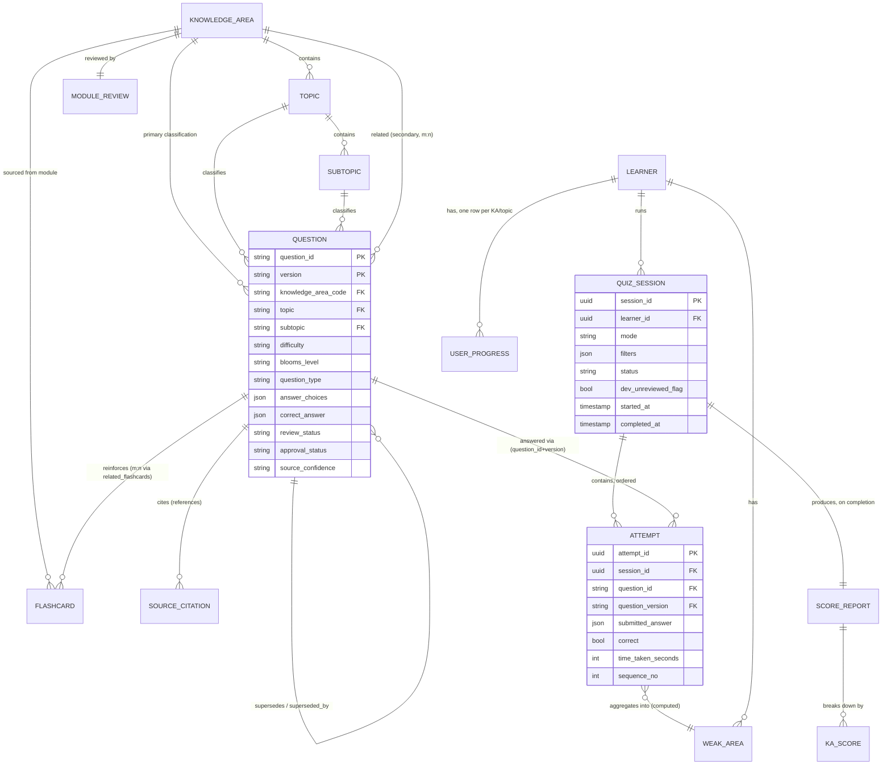

# Domain Model

## Purpose and Scope

This document defines every business object the platform reasons about, and the relationships between them, precisely enough to drive schema design (`SYSTEM_ARCHITECTURE.md`'s `content` and `runtime` PostgreSQL schemas) without re-deciding anything `question_bank/metadata_schema.md`, `question_bank/taxonomy.md`, `question_bank/versioning.md`, `quiz_engine/scoring_engine.md`, or `quiz_engine/progress_integration.md` already settled at the conceptual level. Where this document names a field, it is inheriting that field from one of those documents, not inventing it — the contribution here is turning "conceptual field reference" into "typed entity with explicit relationships and lifecycle."

Two schemas, matching `SYSTEM_ARCHITECTURE.md`'s Data Flow:

- **Content entities** (`content` schema) — slow-changing, authored, reviewed, git-tracked in origin, mirrored into PostgreSQL by ingestion. Immutable at a given version.
- **Runtime entities** (`runtime` schema) — fast-changing, produced by the Engine Core as learners use the system. Append-heavy, never hand-edited.

---

## Entity Relationship Diagram

---

## Content Entities

### KnowledgeArea

The top of the classification hierarchy. One row per DMBOK2 Knowledge Area — a fixed set of 14, per `question_bank/naming_conventions.md`'s code table and `question_bank/taxonomy.md`'s Knowledge Area Index.

| Field | Type | Notes |
|---|---|---|
| `code` (PK) | string | e.g. `GOV`, `QUAL` — permanent, per `naming_conventions.md`; never changes once assigned |
| `name` | string | e.g. "Data Governance" |
| `dmbok2_chapter` | int | e.g. 3 |
| `exam_weight_pct` | decimal, nullable | Directional, not official (`research/cdmp_exam_overview.md`) — nullable because the source explicitly flags this as prep-vendor-estimated, not DAMA-published; the field must be able to represent "unknown/unconfirmed," never a fabricated precise number |
| `knowledge_base_file` | string | e.g. `data_governance.md` |
| `content_status` | enum: `NotStarted / InProgress / Approved` | Mirrors `knowledge_base/README.md`'s status — today, all 14 are `Approved` |

**Relationships:** `KnowledgeArea` 1→* `Topic` (owns its topic breakdown). `KnowledgeArea` 1→* `Question` as **primary** classification, and *→* `Question` as **secondary/related** classification (the `related_knowledge_areas` field, `metadata_schema.md`) — this second relationship is genuinely many-to-many and must be modeled as its own join table (`question_related_knowledge_area`), not folded into the primary FK, because `taxonomy.md`'s Cross-Knowledge-Area Tagging explicitly requires a question to name several KAs without diluting its one primary classification.

### Topic / Subtopic

Two further levels of the same hierarchy, per `question_bank/taxonomy.md`. Deliberately **not** a generic recursive "Category" tree — Knowledge Area → Topic → Subtopic is a fixed three-level depth in this domain (`taxonomy.md`: "This document defines the subject classification structure... Knowledge Area → Topic → Subtopic"), and modeling it as three explicit levels rather than an arbitrary-depth tree keeps every query (e.g., "all questions under GOV's 'Roles and Accountability' topic") a simple two-join query instead of a recursive one.

| Entity | Fields | Parent |
|---|---|---|
| `Topic` | `id` (PK), `knowledge_area_code` (FK), `name` | `KnowledgeArea` |
| `Subtopic` | `id` (PK), `topic_id` (FK), `name` | `Topic` |

**Why Topic/Subtopic are entities, not free-text fields on Question**, despite `metadata_schema.md` describing them as plain strings: normalizing them lets the Engine Core query "how many questions exist in this topic" and "which subtopics have zero questions" (a real gap-detection need — `question_bank/roadmap.md` Phase 1's "author net-new questions to fill gaps `taxonomy.md` reveals") without string-matching against free text scattered across 266+ rows. The controlled-list nature `metadata_schema.md` already specifies ("controlled list per KA" / "controlled list per topic") is exactly what a foreign key enforces structurally instead of by convention.

### Question

The central content entity. One row per **(question_id, version)** pair — this composite key, not `question_id` alone, is the entity's true identity, per `question_bank/versioning.md`'s core principle.

| Field | Type | Notes |
|---|---|---|
| `question_id` (PK part 1) | string | e.g. `GOV-001` — permanent, never reused (`naming_conventions.md`) |
| `version` (PK part 2) | string, `MAJOR.MINOR` | Starts at `1.0`; only one version per `question_id` may be non-Retired at a time (`versioning.md`'s supersession rule) |
| `knowledge_area_code` (FK) | → `KnowledgeArea.code` | Primary classification |
| `topic_id` (FK) | → `Topic.id` | |
| `subtopic_id` (FK) | → `Subtopic.id` | |
| `difficulty` | enum: Beginner/Intermediate/Advanced/Expert | `question_bank/difficulty_framework.md` |
| `blooms_level` | enum: Remember/Understand/Apply/Analyze/Evaluate/Create | `[Industry Practice]` per `difficulty_framework.md`'s Sourcing Note |
| `learning_objective` | text | |
| `dama_concept` | text, nullable | `[DAMA]`-tagged |
| `industry_practice_concept` | text, nullable | `[Industry Practice]`-tagged |
| `keywords` | array of string | |
| `estimated_solving_time` | int (seconds) | |
| `question_type` | enum (7 values) | Multiple Choice / Multiple Select / True-False / Scenario-Based / Matching / Ordering / Mini Case Study |
| `stem` | text (Markdown) | |
| `answer_choices` | **JSONB** | Shape varies by `question_type` — see "Polymorphic Answer Shape," below |
| `correct_answer` | **JSONB** | Shape varies by `question_type` — same rationale |
| `explanation` | text (Markdown) | |
| `why_incorrect` | JSONB array of `{option, reason}` | |
| `source_confidence` | enum: High/Medium/Low | |
| `review_status` | enum, matches `question_lifecycle.md`'s state machine | Draft / TechnicalReview / DAMAReview / Approval / Published / Retired |
| `approval_status` | enum: Pending/Approved/Rejected | Distinct axis from `review_status`, per `metadata_schema.md` |
| `author`, `reviewer[]` | string, array of string | |
| `creation_date`, `last_modified` | date | |
| `supersedes`, `superseded_by` | nullable FK → `Question(question_id, version)` | System-managed, per `versioning.md` |

**Polymorphic answer shape — a deliberate modeling decision, not a shortcut.** `metadata_schema.md`'s "Type-Specific Answer Structures" table and `quiz_engine/answer_evaluation.md`'s "Core Rule: Evaluate by Shape, Not by Label" together establish that `answer_choices` and `correct_answer` are not uniformly shaped across question types (a plain list for Multiple Choice, two labeled lists for Matching, an unordered list for Ordering, nested sub-answers for Mini Case Study) — and, critically, that evaluation code must already branch on the *actual shape found*, not the type label (the verified `GOV-016` case: labeled Scenario-Based, shaped as Multiple Select). Modeling these two fields as strongly-typed relational structures (e.g., a separate `AnswerOption` table with a `kind` discriminator) would force a schema migration every time a new shape is introduced and would still need the same shape-sniffing logic in the application layer. JSONB columns validated against a **Pydantic discriminated union** (keyed off `question_type`, matching `cdmp_content_schema`) captures the same guarantee at the application layer where `answer_evaluation.md` already requires it to live, without over-normalizing storage for a set of shapes that only Mini Case Study nests recursively.

**Relationships:**
- `Question` *↔* `KnowledgeArea` — primary (1) + related (*, via join table), as above.
- `Question` *↔* `Flashcard` — many-to-many via `related_flashcards` (a question can reinforce several flashcards; a flashcard can be reinforced by several questions).
- `Question` 1→* `SourceCitation` — the `references` field, modeled as its own entity (below) rather than a plain string array, because a citation is itself a structured claim (file + section + optional DMBOK2 chapter) that Analytics and DAMA Review both need to resolve programmatically, per `question_bank/architecture.md`'s "must resolve to a real, Approved `knowledge_base/*.md` file and section."
- `Question` → `Question` (self-referential) — `supersedes`/`superseded_by`, forming the version lineage chain described in `versioning.md`.
- `Question` 1→* `Attempt` (runtime schema) — via `(question_id, version)`, never a hard relational FK with cascade delete, because `versioning.md` and `progress_integration.md` both require historical attempts against a since-Retired version to remain permanently valid and queryable.

### Flashcard

A term/definition pair sourced from a `knowledge_base/*.md` module's Section 12 (Flashcards), per `knowledge_base/README.md`'s template and `question_bank/architecture.md`'s Flashcard System consumer definition.

| Field | Type |
|---|---|
| `id` (PK) | uuid |
| `knowledge_area_code` (FK) | → `KnowledgeArea.code` |
| `term` | string |
| `definition` | text |
| `source_section` | string, e.g. "Section 12" |

**Relationships:** `KnowledgeArea` 1→* `Flashcard` (a module owns its flashcard set). `Question` *↔* `Flashcard` many-to-many, as above.

### SourceCitation

A structured reference, replacing the plain-string `references` array with something Analytics/Review tooling can validate.

| Field | Type |
|---|---|
| `id` (PK) | uuid |
| `question_id`, `question_version` (FK) | → `Question` |
| `source_tier` | enum: `DAMA / IndustryPractice / RegulationStandard` — mirrors `CLAUDE.md`'s tagging convention |
| `target_file` | string, e.g. `data_governance.md` |
| `target_section` | string, e.g. "Section 3, Data Owner" |
| `dmbok2_chapter` | int, nullable |

**Why this is its own entity and not just a copy of `references`:** the source hierarchy in `research/source_map.md` and the tagging discipline in `CLAUDE.md` §5 are not optional metadata — they are what a DAMA Reviewer checks at Gate 2 (`question_bank/review_process.md`) and what `versioning.md` says must be "re-validated" when a cited `knowledge_base/` module changes. A structured citation is what makes that re-validation a query ("find every `SourceCitation` pointing at `data_governance.md, Section 3`") instead of a full-text search.

### ModuleReview

Corresponds one-to-one with a completed `reviews/<module_name>_review.md` file, per `reviews/review_template.md`.

| Field | Type |
|---|---|
| `id` (PK) | uuid |
| `knowledge_area_code` (FK) | → `KnowledgeArea.code` |
| `review_date` | date |
| `reviewer` | string |
| `module_version` | string |
| `overall_score` | int, 0–100 |
| `criteria_scores` | JSONB — 11 entries, one per `review_template.md`'s Evaluation Criteria (CDMP Exam Readiness, DAMA Terminology Accuracy, Coverage Completeness, Practical Relevance, DAMA vs. Industry Practice Separation, Internal Consistency, Enterprise Examples, Practical Exercises, Flashcards, Quiz Quality, References) |
| `status` | enum: `Draft / NeedsImprovement / Approved` |
| `final_verdict` | text |

**Relationship:** `KnowledgeArea` 1→1 `ModuleReview` under the current one-review-per-module policy (`CLAUDE.md`'s Review Workflow updates the same file in place rather than creating a second review) — modeled as 1:1 rather than 1:*, matching that the review file is *updated*, not appended to, across Improvement Workflow iterations. If a future policy allows historical review snapshots, this would become 1:* with a `superseded_by` pointer identical in shape to `Question`'s own versioning pattern — noted here as a deliberate non-goal today, not an oversight.

### ValidationResult

Not a persisted entity — a transient value object produced by the Content Ingestion pipeline (`SYSTEM_ARCHITECTURE.md`) for every file it processes, mirroring `quiz_engine/data_loading.md`'s Error Reporting requirements.

| Field | Type |
|---|---|
| `file_path` | string |
| `passed` | bool |
| `errors` | list of `{field, expected, actual, reason}` |
| `warnings` | list of string |

**Why this is not a table:** ingestion runs are ephemeral operational events, not content or learner history — persisting them would conflate a build-tool log with the domain model. If audit history of ingestion runs is ever needed, it belongs in structured application logs, not the `content`/`runtime` schemas.

---

## Runtime Entities

### Learner

Modeled explicitly, even though the project is single-learner today (`SYSTEM_ARCHITECTURE.md`'s Concurrency section), so that every other runtime entity's foreign key to a learner is already correct shape for a future multi-user extension.

| Field | Type |
|---|---|
| `id` (PK) | uuid |
| `display_name` | string |
| `created_at` | timestamp |

A single seeded row exists today. No authentication model is attached to this entity — that is explicitly out of scope per both `quiz_engine/architecture.md`'s and this document's Non-Goals.

### QuizSession

One row per quiz attempt, from `quiz start` to completion or abandonment. Corresponds to `quiz_engine/architecture.md`'s Quiz Session concept and `quiz_engine/progress_integration.md`'s Per-Session Record.

| Field | Type | Notes |
|---|---|---|
| `session_id` (PK) | uuid | |
| `learner_id` (FK) | → `Learner.id` | |
| `mode` | enum: Practice/KnowledgeArea/Difficulty/ExamSimulation/Weakness | `quiz_engine/quiz_modes.md` |
| `filters` | JSONB | e.g. `{"knowledge_area": "GOV"}` or `{"difficulty": "Advanced"}` — shape varies by mode, same polymorphism rationale as `Question.answer_choices` |
| `status` | enum: InProgress/Completed/Abandoned | `InProgress` is what `cli_design.md`'s `quiz resume` recovers from |
| `dev_unreviewed_flag` | bool | Must propagate to every `Attempt`/`ScoreReport` produced under it, per `data_loading.md`'s "never dropped silently" rule |
| `timing_profile` | JSONB, nullable | Populated only for Exam Simulation Mode (time limit, ESL accommodation flag) |
| `started_at`, `completed_at` | timestamp, nullable | |

**Relationships:** `Learner` 1→* `QuizSession`. `QuizSession` 1→* `Attempt` (ordered by `sequence_no`). `QuizSession` 1→1 `ScoreReport`, created only on completion — an in-progress session has no score report yet, matching `scoring_engine.md`'s framing of scoring as a session-completion concern (per-question grading happens continuously via `Attempt.correct`, but the five aggregate score types are computed once, at the end).

### Attempt

The finest-grained unit of learner history — one row per answered (or explicitly skipped) question. Directly implements `quiz_engine/progress_integration.md`'s Per-Attempt Record.

| Field | Type | Notes |
|---|---|---|
| `attempt_id` (PK) | uuid | |
| `session_id` (FK) | → `QuizSession.session_id` | |
| `question_id`, `question_version` (FK) | → `Question(question_id, version)` | Both fields, always — `versioning.md`'s identity rule |
| `sequence_no` | int | Position within the session |
| `knowledge_area_code`, `topic_id`, `subtopic_id`, `difficulty`, `blooms_level` | copied from `Question` at answer time | Deliberately denormalized/copied, not joined live — `progress_integration.md`: "so historical analysis remains accurate even if the question's classification changes in a future version" |
| `question_type` | copied from `Question` at answer time | |
| `submitted_answer` | JSONB | Same shape family as `Question.correct_answer` |
| `correct` | bool, nullable | Null = skipped/unattempted, distinct from incorrect (`cli_design.md`'s "explicit skip") |
| `incorrect_reasons` | JSONB array of string, nullable | Populated from the matched `why_incorrect` entries, per `answer_evaluation.md` |
| `time_taken_seconds` | int, nullable | Null if skipped |
| `mode` | copied from parent `QuizSession.mode` | For type-specific trend analysis independent of joining back to the session |
| `presented_at`, `answered_at` | timestamp | |

**Why `correct` is nullable rather than a plain boolean:** `cli_design.md` explicitly requires a skip to be "distinct from incorrect... since an unattempted question shouldn't count against a topic's miss rate the same way a genuinely wrong answer does." A two-state boolean cannot express that distinction; a nullable boolean (true/false/null) can, and every downstream consumer (`ScoreReport`, `WeakArea`) must treat null as "excluded from the denominator," not as "incorrect."

### ScoreReport

One row per completed `QuizSession`, implementing `quiz_engine/scoring_engine.md`'s Score Record Shape exactly.

| Field | Type |
|---|---|
| `session_id` (PK, FK) | → `QuizSession.session_id` |
| `raw_score` | int |
| `questions_attempted` | int |
| `percentage` | decimal |
| `difficulty_adjusted_score` | decimal, nullable |
| `readiness_band` | enum, nullable: `NotYetAssociate / AssociateReady / PractitionerLevel / MasterLevel` |
| `coverage_caveat` | bool | Whether partial-KA-coverage applied (relevant chiefly to Exam Simulation sessions, per `quiz_modes.md`) |

**Relationship:** `ScoreReport` 1→* `KAScore` (the per-Knowledge-Area breakdown — a genuine child collection, not a JSONB blob, because `WeakArea` computation and `progress_integration.md`'s trend tracking both need to query "this KA's score across sessions" directly).

### KAScore

| Field | Type |
|---|---|
| `id` (PK) | uuid |
| `session_id` (FK) | → `ScoreReport.session_id` |
| `knowledge_area_code` (FK) | → `KnowledgeArea.code` |
| `correct`, `total` | int |
| `percentage` | decimal, computed |
| `low_confidence` | bool | True when `total` is below the configured minimum sample size (`scoring_engine.md` §3) |

### UserProgress

A materialized, per-Learner-per-KA (or per-Topic, once volume supports that granularity) rollup, refreshed as new sessions complete — the read-optimized view `progress_integration.md`'s Improvement Trends section describes ("a simple time-ordered list of (date, score) pairs").

| Field | Type |
|---|---|
| `id` (PK) | uuid |
| `learner_id` (FK) | → `Learner.id` |
| `knowledge_area_code` or `topic_id` (FK) | Whichever granularity has sufficient sample size |
| `history` | JSONB array of `{session_id, date, percentage}` | Append-only |
| `current_trend` | enum: Improving/Flat/Declining, computed | |
| `last_updated` | timestamp | |

**Relationship:** `Learner` 1→* `UserProgress` (one row per KA/topic the learner has attempted). Distinct from `WeakArea` below: `UserProgress` is a *descriptive* trend view for human review (`progress show`); `WeakArea` is a *prescriptive* signal for Selection to consume.

### WeakArea

The computed output of `progress_integration.md`'s Weak-Area Detection algorithm — the entity that closes the feedback loop into Weakness Mode.

| Field | Type |
|---|---|
| `id` (PK) | uuid |
| `learner_id` (FK) | → `Learner.id` |
| `topic_id` or `knowledge_area_code` (FK) | Topic-level preferred; falls back to KA-level if attempt volume is too low, per `progress_integration.md` |
| `miss_rate` | decimal | Recency-weighted, per `progress_integration.md`'s rule that recent attempts outweigh old ones |
| `sample_size` | int | Must meet the configured minimum (proposed default: 4 attempts) before this row is eligible to be "active" |
| `status` | enum: `Active / Resolved` | `Resolved` once recent performance no longer exceeds the miss-rate threshold — rows are never deleted, only status-flipped, preserving history of what used to be weak |
| `last_computed_at` | timestamp | |

**Relationship:** `WeakArea` is derived from `Attempt` (aggregation, not a foreign key relationship in the traditional sense — it is recomputed from a rolling window of `Attempt` rows, not maintained incrementally by a trigger, at this project's scale). `Question Selection` (Engine Core) reads `WeakArea` rows with `status = Active` as its sole input for Weakness Mode, per `question_selection.md`'s algorithm.

---

## Cross-Schema Rule: Content Never Points Into Runtime

No `content`-schema entity holds a foreign key into the `runtime` schema. `Question` has no knowledge of how many times it has been attempted or by whom — that association only exists from the `runtime` side (`Attempt.question_id`/`question_version` pointing outward). This is the same content/delivery separation principle from `question_bank/architecture.md`, expressed as a database-schema-boundary rule rather than a prose principle: it is what allows the `content` schema to be rebuilt from source files at any time (a full re-ingestion) without touching, invalidating, or needing to reconcile a single row of learner history in `runtime`.

## Non-Goals of This Document

- No literal SQL DDL, index strategy, or ORM mapping syntax is specified — that is implementation work following from this model, described at the sprint level in `IMPLEMENTATION_PLAN.md`.
- No multi-tenant/authorization model is designed beyond the `Learner` seam already described.
- No caching or read-replica strategy is specified — premature before real query-volume data exists.
