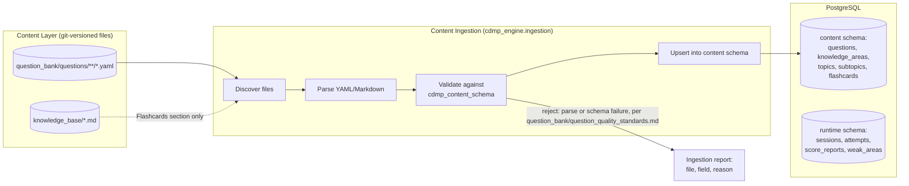
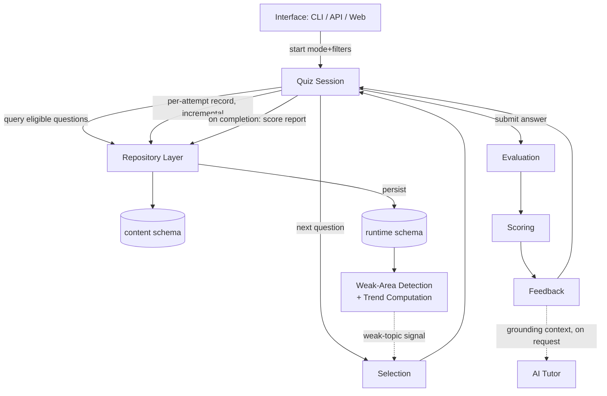

# System Architecture

## Status of This Document

This is the Engineering Phase's architecture baseline, written after a full Engineering Readiness Review of the repository as it exists today (2026-08-03). It does not start from zero: it is a continuation of, and in several places a formalization of, decisions already made in `question_bank/architecture.md` and `quiz_engine/architecture.md` — those documents fixed *behavior and contracts*, deliberately deferring technology and storage decisions ("no file format, database engine, or programming language is chosen yet"). This document, together with `TECH_STACK.md`, is where those deferrals are resolved. Nothing here contradicts the prior design docs; where this document narrows an open question, it says so explicitly.

**Ground truth this document is built against, not assumptions:**

- `question_bank/questions/` holds **266 real question records** across all 14 Knowledge Areas (13 at 20 questions each, `data_management_maturity_assessment` at 6) — **140 `Published`, 126 `Draft`**. This is a materially different (and better) starting position than the ten `quiz_engine/*.md` design docs assumed (they were written against "120 Phase 1 questions, all Draft, 6 of 14 KAs covered").
- `knowledge_base/` holds all 14 Approved Knowledge Area modules, each following the 14-section template in `knowledge_base/README.md`.
- `quiz_engine/src/quiz_engine/` is a working, tested (33 tests) Python package: a YAML loader with lifecycle filtering, random/KA/difficulty selection, shape-based answer evaluation, and Raw Score/Percentage/KA-breakdown scoring, exposed today only via `python -m quiz_engine` (argparse, in-memory, no persistence).
- `progress/` and `notes/` are empty — no persistence layer exists yet at any level.

This document's job is to take that real starting point to a production-quality, multi-interface platform (CLI, Python package, REST API, web application, AI Tutor) without re-litigating decisions the content-side documents already made correctly.

---

## Guiding Principles (inherited, not re-decided)

These four principles are load-bearing across the whole system and were established before this document existed. Every component boundary below exists to preserve them, not the other way around.

1. **Content/delivery separation** (`question_bank/architecture.md`). Question and Knowledge Area content is authored once, reviewed once, and consumed everywhere. No delivery surface (engine, API, web, CLI, AI Tutor) embeds question content in its own code; all of them read it through one path.
2. **Stateless core, stateful session** (`quiz_engine/architecture.md`). Selection, evaluation, scoring, and feedback are pure functions of (question data, session history). The Quiz Session is the only stateful object, and every interface holds it the same way.
3. **Published-only visibility** (`question_bank/question_lifecycle.md`, `question_bank/architecture.md` "Question State Visibility by Consumer"). Only `review_status: Published` questions are visible to any consuming system by default. Today this means the engine's real, non-dev-mode content pool is the 140 Published questions, not all 266 — a fact every downstream component (especially Exam Simulation Mode's exam-weight sampling) must reason about honestly rather than silently.
4. **Identity survives revision** (`question_bank/versioning.md`). A question's identity is `question_id` + `version`, never `question_id` alone. Every score, attempt, and progress record in this system carries both, permanently.

---

## Component Map

The system is organized into six layers. Each layer has exactly one reason to change; a change in one layer should never require a change in another (the standard this project already held itself to in `question_bank/architecture.md`'s Access Layer rationale).

| Layer | Component | Responsibility | Reads | Writes | Owns |
|---|---|---|---|---|---|
| **Content** | `knowledge_base/`, `question_bank/questions/` | Authoritative CDMP content: modules and question records, git-versioned Markdown/YAML | Human/mentor authoring input | Nothing programmatically — edited only through the authoring/review workflow in `CLAUDE.md` and `question_bank/review_process.md` | Content correctness, DAMA sourcing discipline, `[DAMA]`/`[Industry Practice]` tagging |
| **Content Ingestion** | `cdmp_content_schema` (Pydantic models) + `cdmp_engine.ingestion` | Discover, parse, validate every content file against the schema contract; load validated records into the runtime store | `question_bank/questions/**/*.yaml`, `knowledge_base/*.md` Flashcards sections | PostgreSQL `content` schema (questions, knowledge_areas, topics, subtopics, flashcards, references) | Schema conformance, the Loader's validation rules (`quiz_engine/data_loading.md`), lifecycle-state correctness |
| **Engine Core** | `cdmp_engine` (selection, evaluation, scoring, feedback, progress) | Assemble quizzes, grade answers, compute scores, build feedback payloads, persist and query progress | `content` schema (read-only) + `runtime` schema (sessions/attempts, read-write) | `runtime` schema (sessions, attempts, score reports, computed weak areas) | All quiz-mode behavior (`quiz_engine/quiz_modes.md`), all scoring rules (`quiz_engine/scoring_engine.md`), all evaluation rules (`quiz_engine/answer_evaluation.md`) |
| **Interface** | `apps/quiz_cli` (Typer), `apps/api` (FastAPI) | Translate a specific interaction medium (terminal, HTTP) into calls against the Engine Core's one stable contract (start / next-question / submit-answer / end) | Engine Core's public API | Nothing of its own — every write goes through Engine Core | Presentation and protocol only, never business logic |
| **Presentation** | `apps/web` (Next.js) | Browser UI over the REST API | `apps/api` over HTTP only | Nothing directly — all writes go through the API | Rendering, client-side interaction state only |
| **Augmentation** | AI Tutor integration (Claude API client, invoked from the Feedback stage) | Expand an explanation on request, grounded in the question's own metadata | Feedback payload (`quiz_engine/feedback_system.md`'s five required elements) | Nothing — it is a read-and-respond augmentation, never a content author | Grounding discipline: never introduces an ungrounded DAMA claim |

### Why these six layers and not fewer

Collapsing Content Ingestion into Engine Core would tie question-bank schema evolution to quiz-selection logic changes, which are genuinely different concerns with different change cadences (content grows continuously; selection algorithms change rarely). Collapsing Interface into Engine Core would be the mistake `quiz_engine/architecture.md` already warned against — "none of the five target interfaces talk to the Loader, Question Engine, Scoring, or Feedback stages directly." Keeping Presentation strictly behind the API (never importing the Python engine directly) is what makes the web app additive rather than a second implementation, exactly as `quiz_engine/architecture.md`'s Future Integration section already specified.

---

## Package Boundaries

Proposed physical layout (a single-repository, multi-package structure — not a rewrite of existing content directories, which keep their current paths and meaning):

```
CDMP-Mastery/
├── knowledge_base/                 # unchanged — content, not code
├── question_bank/                  # unchanged — content, docs, and questions/ data
├── reviews/                        # unchanged — module review records
├── research/, roadmap/, sources/   # unchanged
├── progress/                       # becomes a legacy/export directory once runtime persistence
│                                   # moves to PostgreSQL (see Data Flow) — kept for human-readable
│                                   # exports (e.g., a periodic CSV/Markdown progress snapshot), not
│                                   # the system of record
│
├── packages/
│   ├── cdmp_content_schema/        # Pydantic models mirroring question_bank/metadata_schema.md
│   │                                #   field-for-field; the ONE schema definition shared by
│   │                                #   ingestion, engine, and API — replaces the hand-rolled
│   │                                #   dataclasses in quiz_engine/src/quiz_engine/models/
│   └── cdmp_engine/                # evolves quiz_engine/src/quiz_engine/ in place:
│       ├── ingestion/              #   (new) content discovery, validation, load-to-DB
│       ├── loader/                 #   (existing, adapted) now reads from DB via repository, not YAML directly
│       ├── selection/              #   (existing, extended) full question_selection.md algorithm
│       ├── scoring/                #   (existing, extended) adds Difficulty Adjustment + Readiness Indicator
│       ├── evaluation/             #   (existing) shape-based grading, unchanged in principle
│       ├── feedback/               #   (new) assembles feedback_system.md's five-element payload
│       ├── progress/                #   (new) session/attempt/score persistence + weak-area detection
│       └── repository/             #   (new) defines the `Repository` Protocol (the abstraction every
│                                    #   other sub-package depends on) plus two implementations:
│                                    #   `SQLAlchemyRepository` (production) and `InMemoryRepository`
│                                    #   (test-only fake) — the only code that issues SQL; every other
│                                    #   package talks to the `Repository` Protocol, never to a concrete
│                                    #   implementation or the database directly (see TECH_STACK.md's
│                                    #   Repository Interface section)
│
├── apps/
│   ├── quiz_cli/                   # Typer app — supersedes quiz_engine/src/quiz_engine/cli/
│   ├── api/                        # FastAPI app — thin HTTP wrapper over cdmp_engine
│   └── web/                        # Next.js app — presentation layer over apps/api only
│
├── infra/
│   ├── docker-compose.yml          # local Postgres + api for development
│   ├── migrations/                 # Alembic migration scripts (versions the `content` and
│   │                                #   `runtime` schemas independently — see DOMAIN_MODEL.md)
│   └── ci/                         # GitHub Actions workflow definitions
│
└── quiz_engine/*.md, question_bank/*.md, CLAUDE.md   # design/governance docs, unchanged in meaning;
                                                        # kept as the specifications this code is built against
```

**Dependency direction (strict, one-way):**

```
cdmp_content_schema
        ^
        |
   cdmp_engine  <-- infra/migrations (schema definitions live in repository/, migrations generated from them)
    ^   ^   ^
    |   |   |
quiz_cli api  (ingestion is invoked as a cdmp_engine subcommand/job, not a separate app)
        ^
        |
      web        (HTTP only — web never imports any Python package)
```

No package below the line imports anything above it. `apps/api` and `apps/quiz_cli` both depend on `cdmp_engine` and `cdmp_content_schema`, never on each other. `apps/web` depends on nothing in this repository except the API's OpenAPI-described HTTP contract. This is the concrete implementation of `quiz_engine/architecture.md`'s "one contract, many thin clients" principle.

**The same rule applies one level down, inside `cdmp_engine`.** `selection`, `scoring`, `evaluation`, and `progress` depend on `repository`'s `Repository` Protocol (an abstract, structural interface — see `TECH_STACK.md`), never on `repository.SQLAlchemyRepository` directly. This is what makes an `InMemoryRepository` test fake possible without any of those four sub-packages knowing or caring that a fake is in use — the Dependency Inversion half of this architecture's SOLID posture, made concrete rather than asserted. Both the top-level and this internal rule are enforced automatically in CI via `import-linter` (`TECH_STACK.md`'s CI/CD section), not by code-review discipline alone.

---

## Data Flow

### Content Authoring → Runtime (the ingestion pipeline)



This is `quiz_engine/data_loading.md`'s Loading Pipeline, promoted from "parse-on-every-process-start, in-memory only" to a proper ingestion job that runs on a content change (locally on demand, or in CI on every merge to `question_bank/questions/`). The distinction matters once three interfaces (CLI, API, web) all need the same content: parsing 266 (and growing) YAML files on every CLI invocation is wasteful and, more importantly, means the API and web app would each need their own copy of the same parsing logic if they read files directly. A single ingestion step, followed by all runtime reads going through PostgreSQL, is what keeps this a one-source-of-truth system as it scales past a single terminal client.

**The lifecycle filter (`review_status`) is preserved exactly, not weakened, by this move.** The `content.questions` table carries `review_status` and `approval_status` as columns; every runtime query defaults to `WHERE review_status = 'Published'`, with the same explicit, loud dev-mode override `data_loading.md` already specifies (`--dev-unreviewed` today; a first-class `include_unreviewed` parameter tomorrow) required to see the other 126 Draft records. Ingestion loads *all* records regardless of status — filtering happens at query time, not at load time — so a question's status can change (Draft → Published) without needing to re-run ingestion from scratch.

### Quiz Session → Progress (the runtime loop)



Identical in shape to `quiz_engine/architecture.md`'s End-to-End Flow — the only change this document makes is naming where each arrow's data actually lives (PostgreSQL tables, not "in-memory" or "proposed `progress/` shapes"). The dotted feedback line (weak-area signal back into Selection) is what makes Weakness Mode real rather than a permanent cold-start fallback, exactly as the original design required.

### Cross-Cutting: AI Tutor Grounding

The AI Tutor is deliberately not drawn as a peer of the Engine Core in the dependency graph above — it is invoked *from* the Feedback stage with a bounded input (the feedback payload: `dama_concept`/`industry_practice_concept` with tags intact, `references`, `related_flashcards`) and must not query the content or runtime database directly. This is an architectural enforcement of `quiz_engine/feedback_system.md`'s grounding contract: the Tutor physically cannot fabricate a claim sourced from data it was never given.

---

## Cross-Cutting Concerns: Configuration, Observability, Resilience

Three concerns touch every layer in the Component Map but belong to none of them individually — naming them here prevents each package from inventing its own answer independently as implementation proceeds:

- **Configuration/secrets** live in one place: environment variables, loaded uniformly by `pydantic-settings` in every entry point (`apps/quiz_cli`, `apps/api`, the ingestion CLI). No package reads `os.environ` directly or hardcodes a connection string. Full detail in `TECH_STACK.md`'s Configuration and Secrets Management section.
- **Observability** (structured logging, the `session_id` correlation convention, `apps/api`'s `/health` endpoint) is a stdlib-based, deliberately minimal cross-cutting layer — not a new component in the table above, because it has no independent responsibility of its own; it is instrumentation threaded through the existing six layers. Full detail in `TECH_STACK.md`'s Observability section.
- **External-dependency resilience** applies specifically to the Augmentation layer's Claude API call today (the system's only outbound third-party network dependency) — timeout, single retry, and graceful degradation to a Tutor-less feedback payload on failure, plus a per-session call cap as a cost guard. Full detail in `TECH_STACK.md`'s AI Tutor Integration section.

---

## Concurrency and Multi-Interface Model

This project remains explicitly single-learner (`quiz_engine/architecture.md`'s Non-Goals, unchanged here), but three interfaces (CLI, API, future web) can now run concurrently against the same PostgreSQL instance — a CLI session in one terminal and a web session in a browser tab are two different `QuizSession` rows, not a shared in-process object. This is the concrete reason PostgreSQL (not an in-memory structure or a single-writer file format) is the runtime store — see `TECH_STACK.md` for the full justification. No authentication or multi-*user* model is introduced by this; `Learner` (see `DOMAIN_MODEL.md`) exists as a single-row table today specifically so a later move to real multi-user auth is additive, not a schema rewrite.

---

## What This Document Deliberately Does Not Do

- It does not modify or reinterpret any behavior already specified in `quiz_engine/*.md` or `question_bank/*.md` — it implements them.
- It does not change how content is authored or reviewed (`question_bank/review_process.md`, `CLAUDE.md`'s Knowledge Base Operating Workflow) — the ingestion pipeline is a new *consumer* of that process's output, not a replacement for it.
- It does not introduce authentication, authorization, or a multi-tenant data model — out of scope until the single-learner premise changes, at which point `Learner` is the seam that absorbs that change.
- It does not specify literal API routes, database DDL, or CLI flag syntax — that is `DOMAIN_MODEL.md` (entities/relationships) and `IMPLEMENTATION_PLAN.md` (build sequence), not this document.
