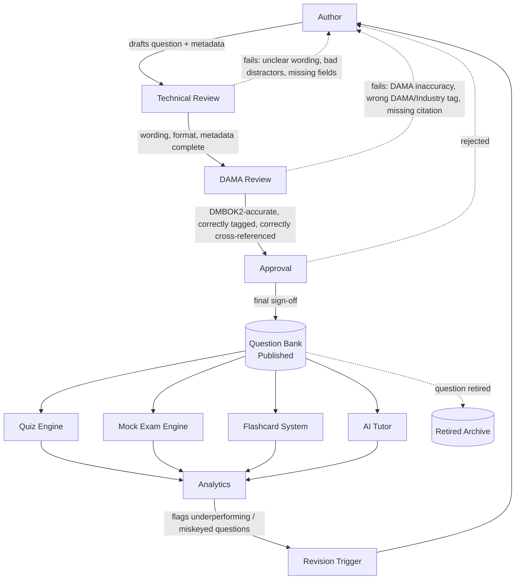
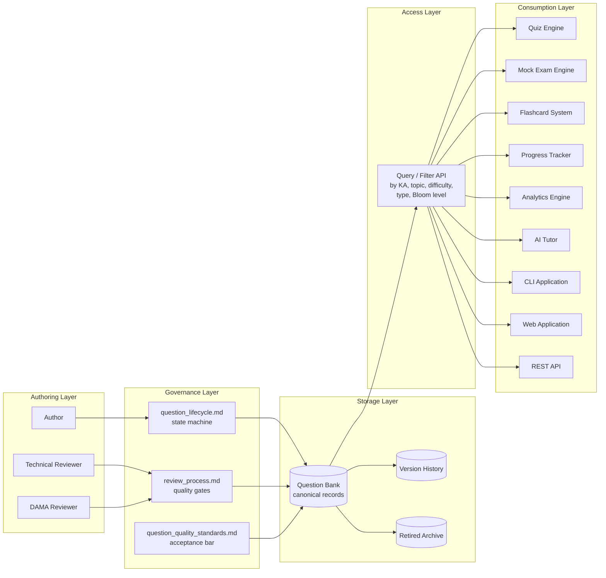

# Question Bank — Architecture

## Core Architectural Principle: Content/Delivery Separation

The Question Bank owns **content**: the questions, their metadata, their correctness, their provenance. It owns nothing about **delivery**: how a quiz is assembled, how a mock exam is timed, how spaced repetition schedules a flashcard, how an AI tutor decides what to ask next. Every delivery surface (Quiz Engine, Mock Exam Engine, Flashcard System, AI Tutor, CLI, future Web App, future REST API) is a **read-only consumer** of the Question Bank at run time, and none of them may embed question content directly in their own code or data.

This matters for one concrete reason: **a question is authored once and reviewed once, but used everywhere.** If the CLI, the web app, and the AI tutor each held their own copy of a question, a correction discovered by one surface (e.g., analytics reveals a flawed distractor) would require finding and fixing every copy independently, and the copies would drift. A single authoritative repository, versioned and gated by one review pipeline, is the only design that keeps every surface consistent.

Only **Published** questions (see `question_lifecycle.md`) are visible to consuming systems. Draft, Technical Review, DAMA Review, and Approval-pending questions exist only inside the authoring/review pipeline and are invisible to every downstream consumer, including analytics.

---

## End-to-End Flow



This is the same author → review → approval → bank → consumption → analytics → feedback loop described in the project brief, made concrete: analytics doesn't just report on questions, it **feeds back into authoring**, closing the loop so the Question Bank improves itself over time rather than only growing.

---

## Layered System View



**Why an Access Layer exists as its own concept (even with no code yet):** every consumer needs to query the bank by combinations of Knowledge Area, topic, difficulty, question type, and Bloom's level (e.g., "give me 20 Intermediate Multiple-Choice questions from Data Governance and Data Quality, excluding anything the learner has already answered correctly twice"). Defining this as a distinct logical layer now — rather than letting each consumer invent its own filtering logic — is what will eventually let the CLI, web app, and REST API all be thin clients over the same query capability instead of three divergent implementations.

---

## Question State Visibility by Consumer

| Consumer | Sees Published | Sees Draft/In-Review | Sees Retired |
|---|---|---|---|
| Quiz Engine | Yes | No | No |
| Mock Exam Engine | Yes | No | No |
| Flashcard System | Yes | No | No |
| AI Tutor | Yes | No | Only if explicitly asked to explain a historical/retired concept |
| Analytics Engine | Yes | No (analytics is response-driven, and only Published questions can be answered) | Yes (historical performance data on a retired question remains valid and queryable) |
| Progress Tracker | Yes (via learner response history) | No | Yes (a learner's past performance on a now-retired question still counts toward their historical record) |
| Author / Reviewer tooling | Yes | Yes | Yes |

This table is the concrete expression of the "only Published is visible downstream" rule stated above — it exists so that a future implementation has an unambiguous contract to build against rather than an implicit assumption.

---

## Storage Model (conceptual — not implemented in this phase)

The Question Bank is one canonical record per question, keyed by a permanent Question ID (see `naming_conventions.md`), with an immutable version history (see `versioning.md`). The intended physical layout, when implementation begins, is:

```
question_bank/
├── (this design documentation — architecture, taxonomy, standards, etc.)
└── questions/                        ← not created in this phase
    ├── GOV/
    │   ├── GOV-001.yaml
    │   ├── GOV-002.yaml
    │   └── ...
    ├── QUAL/
    ├── META/
    ├── ARCH/
    ├── MODEL/
    ├── MASTER/
    └── ... (one directory per Knowledge Area code)
```

One file per question, one directory per Knowledge Area, using the codes defined in `naming_conventions.md`. This mirrors the existing `knowledge_base/` pattern of one file per Knowledge Area, extended one level deeper because a Knowledge Area will eventually hold hundreds of individual question records rather than one module document. The file format (YAML vs. JSON vs. a database) is an implementation decision deferred to when a Quiz Engine is actually built — this document fixes the *shape* of the data, not its eventual storage technology.

---

## Future Integration

Each future consumer's relationship to the Question Bank, defined now so later implementation has no ambiguity about the contract:

### Knowledge Base (`knowledge_base/`)
The upstream source of truth, not a downstream consumer. Every question's `related_knowledge_areas` and source citation must resolve to a real, Approved `knowledge_base/*.md` file and section. If a `knowledge_base/` module is revised after a question is written, the question's `source_confidence` and cross-references must be re-validated (see `versioning.md`).

### Quiz Engine
Queries the bank by Knowledge Area, topic, difficulty, and question type to assemble an ad hoc practice quiz. Read-only. Reports every response (correct/incorrect, time taken) to the Analytics Engine and Progress Tracker. Never modifies a question.

### Mock Exam Engine
A specialized Quiz Engine consumer that assembles full-length, timed, weighted simulations (100 questions / 90 minutes, matching `research/cdmp_exam_overview.md`'s real exam format) by sampling the bank proportionally to each Knowledge Area's documented exam weighting. Requires the bank to have enough Published questions per Knowledge Area, at the right difficulty mix, to avoid overusing the same small question pool — a direct dependency the `roadmap.md` growth targets are sized around.

### Flashcard System
Consumes a narrower slice of the schema (`stem`/front, `correct_answer`/back, `keywords`) plus the `related_flashcards` field, which links a question back to the term/definition flashcards already published inside each `knowledge_base/*.md` module (Section 12, Flashcards). The Flashcard System's spaced-repetition scheduling is Progress-Tracker-driven, not Question-Bank-owned — the bank supplies content, never scheduling state.

### Progress Tracker
Owns the learner's response history (which questions were answered, when, correctly or not) — this state lives *outside* the Question Bank (see `progress/` in the main project structure) and references questions by their permanent Question ID, so a question's later version updates don't corrupt historical records.

### Analytics Engine
Aggregates response data across all consumers to compute per-question statistics (miss rate, average time vs. `estimated_solving_time`, distractor selection distribution) and per-learner statistics (mastery by Knowledge Area/topic). Feeds the Revision Trigger loop in the End-to-End Flow diagram above — a question with an anomalous miss rate or a distractor nobody ever picks is flagged back to authoring for review, not silently left in the bank.

### AI Tutor
The only consumer permitted to *generate* explanatory content beyond what a question's `explanation` field already contains, and only in direct response to a learner's question about a specific bank item — it must ground its explanation in the question's own metadata (`dama_concept`, `references`, `related_knowledge_areas`) rather than inventing new DAMA claims, preserving the same `[DAMA]`/`[Industry Practice]` sourcing discipline used everywhere else in this project. See `roadmap.md` Phase 4 for how AI involvement expands over time, and the guardrails that expansion requires.

### Future Web Application
A presentation layer over the Access Layer's query capability — no new content ownership. Adds session/UI state (current quiz in progress, current answer selection) that is explicitly out of scope for the Question Bank itself.

### Future REST API
The eventual technology-agnostic front door to the Access Layer, exposing the same query-by-Knowledge-Area/topic/difficulty/type/Bloom-level capability described above over HTTP, so the CLI, web app, and any third-party or community tooling (see `roadmap.md` Phase 5) all consume the bank through one contract instead of one integration per client.

---

## Non-Goals of This Architecture (this phase)

- No file format, database engine, or programming language is chosen yet.
- No authentication, authorization, or multi-user editing model is designed yet — this project is currently single-author.
- No performance, scale, or hosting requirements are specified — premature at zero content volume.
- No actual question content exists inside `question_bank/` as a result of this document.
