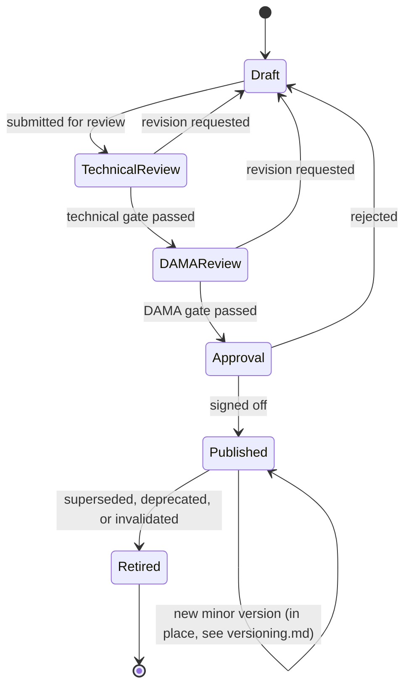

# Question Bank — Question Lifecycle

## Purpose

Every question in the bank is, at all times, in exactly one lifecycle state. This document defines those states, what is true while a question is in each one, who/what can act on it, and the allowed transitions between them. This is the state machine that `architecture.md`'s End-to-End Flow diagram and `review_process.md`'s quality gates both operate against.

## State Diagram

## State Definitions

### Draft
- **Meaning:** A question exists as a record with a permanent ID (see `naming_conventions.md`) but has not yet passed any review gate.
- **Who can act:** The author only. Content, metadata, answer options, and explanation are all freely editable.
- **Visible to:** Author/reviewer tooling only. Never visible to any consuming system (`architecture.md`, "Question State Visibility by Consumer").
- **Entry criteria:** A new question is created, OR an existing question is bounced back from Technical Review, DAMA Review, or Approval with revision requests.
- **Exit criteria:** The author believes the question satisfies every item in `question_quality_standards.md` and submits it for Technical Review.

### Technical Review
- **Meaning:** A reviewer checks the question for wording clarity, format correctness, metadata completeness, and answer-design soundness — **not** DAMA subject-matter accuracy yet.
- **Who can act:** A Technical Reviewer (a role, not necessarily a different person from the DAMA Reviewer in a single-author context — see `review_process.md`).
- **Checks performed:** See `review_process.md`, Gate 1.
- **Exit paths:**
  - **Pass** → DAMA Review.
  - **Fail** → back to Draft, with specific revision notes attached to the question's review history.
- **Visible to:** Author/reviewer tooling only.

### DAMA Review
- **Meaning:** A reviewer with CDMP/DAMA subject-matter expertise checks the question against `research/source_map.md`'s source hierarchy: is the DMBOK2 content accurate, is the `[DAMA]`/`[Industry Practice]` tagging correct, does the explanation and cross-reference actually resolve to the cited `knowledge_base/` section, and is the correct answer actually correct.
- **Who can act:** A DAMA Reviewer (a role — see `review_process.md`).
- **Checks performed:** See `review_process.md`, Gate 2.
- **Exit paths:**
  - **Pass** → Approval.
  - **Fail** → back to Draft, with specific DAMA-accuracy revision notes attached.
- **Visible to:** Author/reviewer tooling only.

### Approval
- **Meaning:** A final sign-off gate confirming the question has passed both prior gates, has complete metadata, and is ready to enter the live bank. This is a deliberate, distinct checkpoint from DAMA Review — passing DAMA Review means the content is *accurate*; passing Approval means the record is *complete and ready for production use* (every required metadata field populated, ID assigned and unique, version set to `1.0`).
- **Who can act:** Approval authority — see `review_process.md`, Gate 3, for who this role is and how it differs from the two reviewer roles.
- **Exit paths:**
  - **Sign-off** → Published.
  - **Rejected** → back to Draft (rare at this stage if Gates 1–2 were done properly; reserved for catching something both reviewers missed).

### Published
- **Meaning:** The question is live in the Question Bank and visible to every downstream consumer (Quiz Engine, Mock Exam Engine, Flashcard System, AI Tutor, Analytics, Progress Tracker).
- **Who can act:** No one edits a Published question's substantive content directly. A correction or improvement is handled through `versioning.md`'s process — either a **minor version** (typo/formatting fix, same state, no re-review required) or a **major version** (substantive change — new content, corrected answer, reworded stem — which creates a new version and re-enters the Draft → Technical Review → DAMA Review → Approval pipeline before that new version itself is Published).
- **Downstream effects:** Response data starts accumulating in Analytics and Progress Tracker from this point on.

### Retired
- **Meaning:** The question is permanently withdrawn from active use. It is no longer served to learners by any consumer, but it is never deleted.
- **Reasons a question is retired** (see `versioning.md` for full detail):
  - Superseded by a new major version of itself.
  - The underlying DMBOK2/exam content it tests has changed (e.g., a `knowledge_base/` module correction invalidates the question).
  - Analytics reveals a structural flaw (e.g., a discriminating-badly question, a miskeyed answer discovered after publication) that a new version doesn't cleanly resolve.
  - The Knowledge Area's exam weighting or scope changes (per `research/cdmp_exam_overview.md` updates) such that the topic is no longer in scope.
- **What is preserved:** All historical learner response data tied to a Retired question's ID remains valid and queryable in Analytics and Progress Tracker (`architecture.md`, "Question State Visibility by Consumer") — retiring a question does not erase the historical record of who answered it and how.
- **Terminal state:** A Retired question does not return to Draft. If its content is still valuable, a **new** question is authored (potentially copying and revising the retired one's content as a starting point) and enters the pipeline fresh with its own ID.

## Cross-References

- Full pass/fail criteria for Technical Review and DAMA Review: `review_process.md`.
- What "complete metadata" means at the Approval gate: `metadata_schema.md`.
- How versioning interacts with the Published state: `versioning.md`.
- The acceptance bar a question must clear to survive both review gates: `question_quality_standards.md`.
