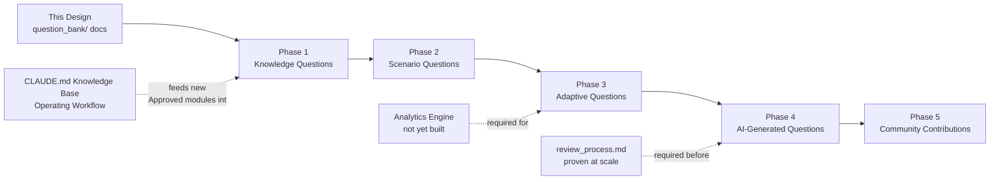

# Question Bank — Roadmap

## Scope Note

This roadmap describes the Question Bank's own internal maturity phases (Phase 1 through Phase 5, below). These are **distinct** from the CDMP Mastery project's broader phase numbering — the project as a whole is currently in its own "Phase 3: Question Bank Architecture" (this design work), which sits entirely *before* the Question Bank's internal Phase 1 begins. Do not conflate the two numbering schemes when referencing either.

## Phase 1 — Knowledge Questions

**Goal:** Populate the bank with straightforward, single-concept questions (Beginner/Intermediate difficulty, per `difficulty_framework.md`) covering every Approved Knowledge Area.

**Entry criteria:** This design (all 12 `question_bank/` documents) exists and is stable. At least one `knowledge_base/` module is Approved.

**Primary activity:** Apply the Reuse-First Principle (`authoring_guidelines.md`) — migrate the existing, already-high-quality Quiz Questions sections from each Approved `knowledge_base/` module (currently: `data_governance.md`, `data_quality.md`, `metadata_management.md`, `data_architecture.md`, `data_modeling_and_design.md`, `reference_and_master_data.md`) into full Question Bank records, running each through the full `review_process.md` pipeline. Author net-new Beginner/Intermediate questions to fill gaps `taxonomy.md` reveals once migration is done.

**Deliverable:** A bank deep enough, per Approved Knowledge Area, to support a real Quiz Engine practice session (`architecture.md`) without excessive repetition.

**Depends on:** `CLAUDE.md`'s Knowledge Base Operating Workflow continuing to produce newly Approved modules — Phase 1's ceiling is bounded by how many Knowledge Areas are Approved at any given time.

## Phase 2 — Scenario Questions

**Goal:** Add Advanced-difficulty Scenario-Based and Mini Case Study questions (`authoring_guidelines.md`, Question Types) that test application and cross-Knowledge-Area reasoning, not just recall.

**Entry criteria:** Phase 1 has produced a stable base of Knowledge Questions across most Approved Knowledge Areas, so scenario questions have enough surrounding factual coverage to build on and enough breadth to draw cross-KA connections from (per `taxonomy.md`'s Cross-Knowledge-Area Tagging).

**Primary activity:** Author original business scenarios (per `authoring_guidelines.md`'s "must not paraphrase a `knowledge_base/` Enterprise Example directly" rule) targeting the Advanced tier, and multi-part Mini Case Studies targeting the Expert tier — directly extending the cross-KA integration approach already planned for Week 12 of `roadmap/four_month_plan.md`.

**Deliverable:** Enough scenario-tier content to support realistic Mock Exam assembly (`architecture.md`, "Mock Exam Engine"), which requires a mix of difficulties proportional to the real exam's blend of definitional and applied questions.

**Depends on:** Phase 1's factual base; the Mock Exam Engine concept in `architecture.md` becoming a real prioritized build target.

## Phase 3 — Adaptive Questions

**Goal:** Use accumulated learner response data (Progress Tracker + Analytics, per `architecture.md`) to select which question to serve next, rather than static quiz assembly — e.g., surfacing more Intermediate-tier questions in a weak topic before advancing that learner to Advanced-tier content in the same topic.

**Entry criteria:** Phases 1–2 have produced enough volume and difficulty spread per Topic/Subtopic (`taxonomy.md`) that an adaptive algorithm has real choices to make; a Progress Tracker and Analytics Engine exist in some working form (`architecture.md`) to supply the response data adaptivity depends on.

**Primary activity:** Design (not build, until this phase is actually reached) the selection logic that reads `difficulty`, `blooms_level`, and a learner's per-Topic mastery signal to choose the next question — this is explicitly a future design task, not specified further here, since it depends on decisions (which Progress Tracker/Analytics implementation exists) not yet made.

**Deliverable:** A defined (not necessarily implemented) adaptive selection contract that the Quiz Engine and AI Tutor can both call into consistently.

**Depends on:** Phases 1–2's content volume; a working Analytics Engine and Progress Tracker.

## Phase 4 — AI-Generated Questions

**Goal:** Allow AI-assisted drafting of new question candidates, without weakening the accuracy or sourcing discipline the bank depends on.

**Entry criteria:** The review pipeline (`review_process.md`) is proven and consistently applied across a meaningful volume of human-authored questions, so there's a trusted quality bar an AI-drafted question can be held to exactly as rigorously as a human-drafted one.

**Primary activity:** AI-generated questions enter the pipeline at **Draft**, identically to human-authored questions — no shortcut through Technical Review or DAMA Review is permitted for AI-generated content; if anything, DAMA Review should be *more* skeptical of AI-drafted content's factual claims, precisely because an AI system can produce fluent-sounding but DMBOK2-inaccurate content with no self-awareness of the error. `question_quality_standards.md`, Standard 10 (No Copyrighted Reproduction) is especially critical here, since an AI system trained on text that includes DMBOK2-derived secondary sources could inadvertently reproduce close paraphrases — DAMA Review must check generated content against this standard explicitly, not assume good faith.

**Deliverable:** A defined guardrail set (this paragraph) that any future AI-generation tooling must operate within — not the tooling itself.

**Depends on:** A mature, trusted Phase 1–2 review pipeline; explicit design of the guardrails above being in place *before* any AI-generated content is drafted, not retrofitted after.

## Phase 5 — Community Contributions

**Goal:** Allow question submissions from outside the original author, once (and only once) the bank, review process, and platform are mature enough to support external contributors without compromising quality or DAMA accuracy.

**Entry criteria:** A public-facing platform exists (Future Web Application and/or Future REST API, per `architecture.md`) with some form of contributor identity and access model — out of scope for this single-author-project design, and explicitly deferred rather than speculated on here.

**Primary activity:** Extend `review_process.md`'s Draft → Technical Review → DAMA Review → Approval pipeline to accept externally-submitted Drafts, with the same gates applied identically regardless of submitter identity — a community-submitted question earns Published status exactly the way an internally-authored one does, through the same checklist, never through a separate or lighter-weight path.

**Deliverable:** Not specified further in this design — Phase 5 is a placeholder for a stage this project is not close to reaching, included here only so the full intended trajectory is visible.

**Depends on:** Everything above; a genuine multi-user platform, which does not exist and is not being built as part of this design phase.

## Phase Dependency Summary

## Explicit Non-Goals of This Roadmap

- No timeline or effort estimate is attached to any phase — this project has no deadline pressure driving it (`CLAUDE.md`'s stated pacing is sustainable, self-paced study).
- No phase is started as a result of publishing this roadmap. Phase 1 begins only when explicitly undertaken as its own piece of work.
- No application, tooling, or code is implied to exist by this document.
