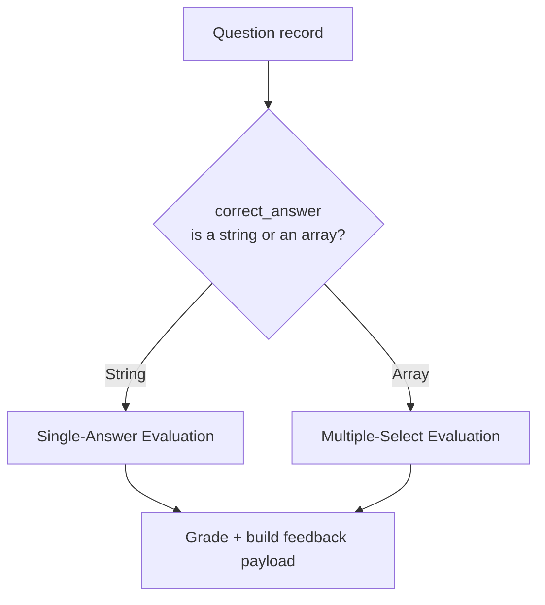

# Quiz Engine — Answer Evaluation

## Purpose

Specifies how a learner's submitted answer is graded against a question's `correct_answer`, for every question type currently in `question_bank/`, plus the design rule that keeps this correct as the bank grows into types it doesn't use yet.

## Core Rule: Evaluate by Shape, Not by Label

`research/question_bank_audit.md` documented a real, verified finding: `GOV-016` is labeled `question_type: "Scenario-Based"` but has a Multiple-Select-shaped `correct_answer` (an array). `question_bank/metadata_schema.md`'s own Type-Specific Answer Structures table confirms this is intentional and schema-valid — Scenario-Based questions may carry either a Multiple-Choice-shaped or Multiple-Select-shaped answer.

**Consequence for this engine:** answer evaluation must branch on the *shape* of `correct_answer` (a single string vs. an array), never on the `question_type` label alone. This is the single most important rule in this document — getting it wrong would silently misgrade `GOV-016` and any future question authored the same way.

## Single-Answer Evaluation

Applies whenever `correct_answer` is a single string — covers `Multiple Choice` questions and any `Scenario-Based` question authored with a single correct option (the majority case, per `research/question_bank_audit.md`'s count of 53 Multiple Choice + most of the 44 Scenario-Based questions).

- **Grading rule:** correct if and only if the learner's selected option letter exactly equals `correct_answer`.
- **Distractor lookup:** if incorrect, the specific `why_incorrect` entry for the learner's *actual* selected option is surfaced (not a generic "wrong" message, and not the reasons for options the learner didn't pick) — this is what makes `feedback_system.md`'s explanation targeted rather than generic.
- **Shuffled options:** if `question_selection.md`'s answer-option shuffling was applied for presentation, evaluation compares against the question's original lettering (tracked internally by the session), not the display order the learner saw — the learner's selection is mapped back before grading.

## Multiple-Select Evaluation

Applies whenever `correct_answer` is an array — covers `Multiple Select` questions and any `Scenario-Based` question authored with a multi-option correct set (`GOV-016` today; potentially others in future authoring rounds).

- **Grading rule (default, all-or-nothing):** correct if and only if the learner's selected set is exactly equal to the `correct_answer` set — same number of options, same options, no more, no fewer. Matches `scoring_engine.md` §1's Raw Score rule.
- **Feedback detail (not a scoring change):** the evaluation result should still capture, separately from the pass/fail grade, which correct options the learner missed and which incorrect options they wrongly included — this finer-grained detail is what powers Practice Mode's optional partial-credit-style feedback (`scoring_engine.md` §1, `feedback_system.md`) without changing how the question is actually scored.
- **Distractor lookup:** every incorrectly-included option's `why_incorrect` entry is surfaced; correctly-omitted distractors need no explanation (the learner got that part right).

## Scenario-Based Questions — Not a Third Algorithm

Per the Core Rule above, "Scenario-Based" is not a distinct evaluation path — it is a *presentation* pattern (a narrative stem before the question) layered on top of either Single-Answer or Multiple-Select evaluation, whichever its `correct_answer` shape indicates. This document deliberately does not define separate "Scenario-Based grading rules" because none exist; `question_bank/metadata_schema.md` already settled this, and duplicating logic for it here would risk the two definitions drifting apart.

## Timing Capture

For every answered question, the engine records time taken (submission timestamp minus question-presented timestamp) alongside the grading result. This feeds two downstream uses:

1. **Feedback** (`feedback_system.md`) may note when a learner took far longer than the question's `estimated_solving_time` (`question_bank/metadata_schema.md`) — a soft signal worth surfacing, not a penalty.
2. **Progress Tracking** (`progress_integration.md`) aggregates this over time as one input to the Analytics layer's future ability to flag a question whose real-world solving time consistently diverges from its authored estimate (`question_bank/versioning.md`'s "Analytics-Driven Revision" concept) — the Quiz Engine's job is only to capture and pass this data through, not to act on it itself.

## Forward Compatibility — Types Not Yet in the Bank

`question_bank/metadata_schema.md` defines four question types with no current content: `True/False`, `Matching`, `Ordering`, and `Mini Case Study`. This design does not build evaluation logic for them now (no data exists to test against), but the shape-based evaluation principle above already anticipates them:

| Type | Expected `correct_answer` shape | Evaluation family it would join |
|---|---|---|
| True/False | A boolean or boolean-equivalent string | Single-Answer (trivial case: two options instead of four) |
| Matching | A set of left→right pairs | A new family — pairwise comparison, not single/multi-select |
| Ordering | An ordered sequence | A new family — sequence comparison, not single/multi-select |
| Mini Case Study | A list of sub-answers, each independently shaped | Delegates to whichever family each sub-question's own `correct_answer` shape indicates — composable, not a new grading algorithm itself |

These are documented here so a future authoring round introducing these types doesn't require re-deriving how they should be graded from scratch — but no evaluation logic for them is specified further than this table until real content exists to validate the design against.

## Non-Goals of This Document

- No natural-language or free-text answer evaluation is designed — every current and near-term question type has a discrete, structured `correct_answer`, so this isn't yet a requirement.
- No confidence-scoring or partial-credit *point values* are specified beyond the binary all-or-nothing rule — see `scoring_engine.md` for why partial credit is feedback-only, not a scoring mechanism.
