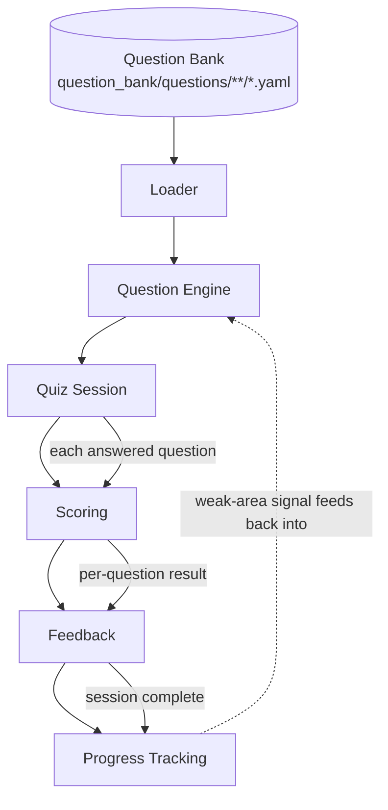
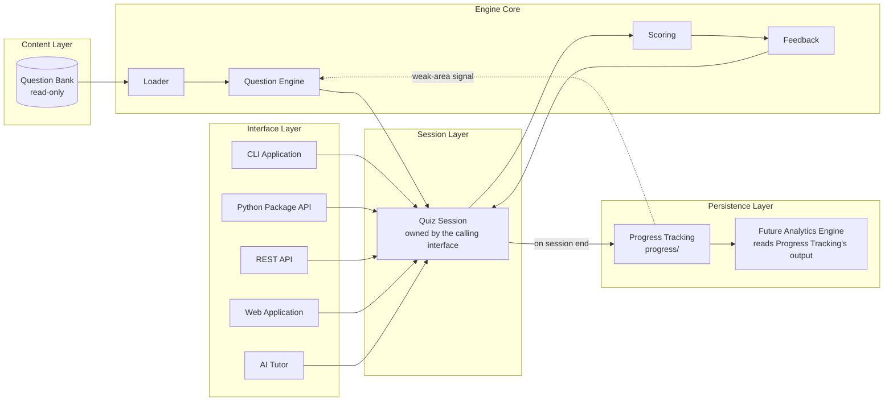
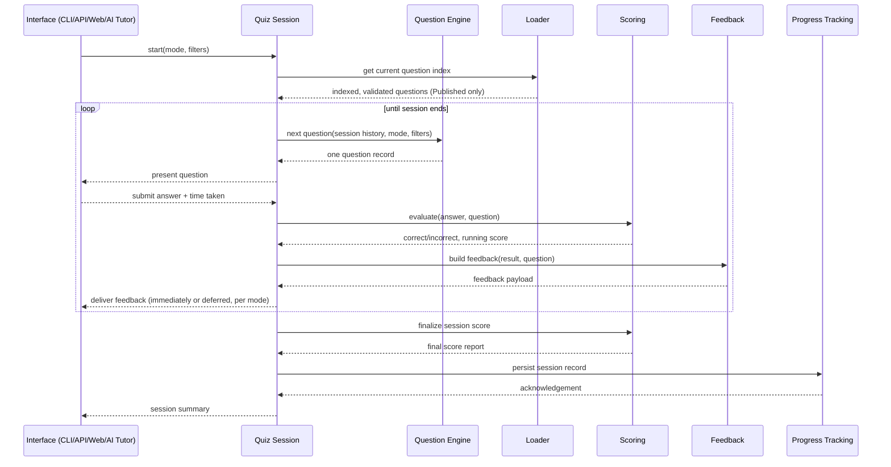

# Quiz Engine — Architecture

## Core Architectural Principle: Stateless Core, Stateful Session, Interface-Agnostic Delivery

The Quiz Engine's core logic (selection, evaluation, scoring, feedback) is **stateless** — given a Question Bank snapshot and a Quiz Session's accumulated state, it produces the next question or the next score deterministically, with no hidden memory of its own. The **Quiz Session** is the only stateful object, and it is owned by whichever interface started it (CLI, API request context, web session, AI Tutor conversation). This is what allows one engine core to power five different interfaces (`README.md`) without duplicating logic in each — the interfaces differ only in how they start a session, present a question, and collect an answer; everything else is shared.

This mirrors `question_bank/architecture.md`'s content/delivery separation one layer down: the Question Bank separates *content* from *delivery*; the Quiz Engine separates *delivery logic* from *presentation*.

---

## End-to-End Flow

This is the exact pipeline specified for this design, with one addition made explicit: **Progress Tracking feeds back into the Question Engine** (dotted line) — this is what makes Weakness Mode possible (`question_selection.md`) and is the single most important loop in the whole system; without it, "Weakness Mode" would have nothing to select from.

## Stage Responsibilities

| Stage | Responsibility | Reads | Writes | Detailed in |
|---|---|---|---|---|
| **Loader** | Discover, parse, validate, and index all eligible question records | `question_bank/questions/**/*.yaml` | An in-memory question index (not persisted) | `data_loading.md` |
| **Question Engine** | Given a mode + filters + session history, select the next question(s) | The Loader's index; the active Quiz Session's history; Progress Tracking's weak-area signal | Nothing (pure selection logic) | `question_selection.md` |
| **Quiz Session** | Hold the state of one in-progress quiz: questions served, answers given, timing, mode/config | Question Engine's output | Its own in-memory/session state | `quiz_modes.md` |
| **Scoring** | Evaluate an answer and compute running/final scores | Quiz Session's answers; the question's `correct_answer`/`why_incorrect` | Per-question and per-session score records | `answer_evaluation.md`, `scoring_engine.md` |
| **Feedback** | Assemble what the learner sees after answering (or at session end) | Scoring's result; the question's `explanation`/`related_flashcards`/`references` | Nothing (presentation payload only) | `feedback_system.md` |
| **Progress Tracking** | Persist session results; compute weak areas and trends over time | Scoring's final session record | `progress/` (proposed record shapes) | `progress_integration.md` |

---

## Layered System View

**Why the Session Layer sits between the Engine Core and every interface:** none of the five target interfaces (`README.md`) talk to the Loader, Question Engine, Scoring, or Feedback stages directly — they all go through a Quiz Session, which is the one object with a stable, interface-agnostic contract (start, next-question, submit-answer, end). This is the same principle `question_bank/architecture.md` used for its Access Layer: one shared contract, many thin clients.

---

## Sequence: One Quiz Session, Start to Finish

This sequence is identical across all five quiz modes (`quiz_modes.md`) — what differs per mode is *when* Feedback is delivered (immediately vs. deferred to session end) and *how* the Question Engine selects (`question_selection.md`), not the shape of the interaction itself.

---

## Design Constraints Inherited from `question_bank/`

These are not new decisions — they are constraints this design must respect because `question_bank/` already established them:

1. **Only Published questions are visible to the Loader** (`question_bank/architecture.md`, "Question State Visibility by Consumer"; `question_bank/question_lifecycle.md`). See `data_loading.md` for how this is enforced and what it currently means in practice, given all 120 Phase 1 questions are presently `review_status: Draft` (`research/question_bank_phase1_validation.md`).
2. **Answer cardinality must be read from `correct_answer`'s shape, not `question_type`'s label** — `research/question_bank_audit.md` documented that `GOV-016` is `Scenario-Based` but has a Multiple-Select-shaped answer. `answer_evaluation.md` builds this in as the core evaluation rule, not a special case.
3. **A question's identity is `question_id` + `version`, not `question_id` alone** (`question_bank/versioning.md`) — every score and progress record this engine produces must reference both, so a later question revision doesn't silently corrupt historical analytics.
4. **Exam-weight-proportional sampling is required, not optional, for anything claiming to simulate the real exam** (`question_bank/architecture.md`, "Mock Exam Engine"; `research/cdmp_exam_overview.md`). `question_selection.md` and `quiz_modes.md`'s Exam Simulation Mode both treat this as a hard requirement, and both flag that it cannot be fully honored today because only 6 of 14 Knowledge Areas have content (`research/question_bank_audit.md` §10).

---

## Future Integration

Each target interface's relationship to the engine core, defined now so later implementation has an unambiguous contract:

### CLI Application
The first interface to be built (`roadmap.md`). A thin process that starts a Quiz Session, renders questions/feedback to the terminal, and collects answers via stdin. Full specification in `cli_design.md`.

### Python Package
The Quiz Session, Question Engine, Scoring, and Feedback stages are designed to be importable as a library (`import quiz_engine`) with no CLI or network dependency — the CLI itself is expected to be one of this package's consumers, not a separate implementation. This is what makes the REST API and AI Tutor integration additive rather than a rewrite.

### REST API
A thin HTTP wrapper exposing the same Quiz Session contract (start / next-question / submit-answer / end) used internally by the CLI, following the same "one contract, many clients" principle `question_bank/architecture.md` established for its own Access Layer.

### Web Application
A presentation layer over the REST API — no new session or scoring logic, consistent with `question_bank/architecture.md`'s equivalent note about its own future Web Application.

### AI Tutor
Plugs into the **Feedback** stage specifically: after a Scoring result is available, the AI Tutor may be asked to expand on an explanation, but must ground that expansion in the question's own metadata (`dama_concept`, `industry_practice_concept`, `references`) exactly as `question_bank/architecture.md`'s AI Tutor consumer definition already requires — the Quiz Engine does not relax that constraint, it inherits it. See `feedback_system.md` for the specific handoff point.

---

## Non-Goals of This Architecture (this phase)

- No programming language, framework, or storage technology is chosen.
- No authentication, multi-user, or concurrency model is designed — this project is currently single-learner.
- No performance or scale requirements are specified — premature before any implementation exists.
- No UI is designed. `cli_design.md` describes command structure and interaction flow, not rendered screens.
