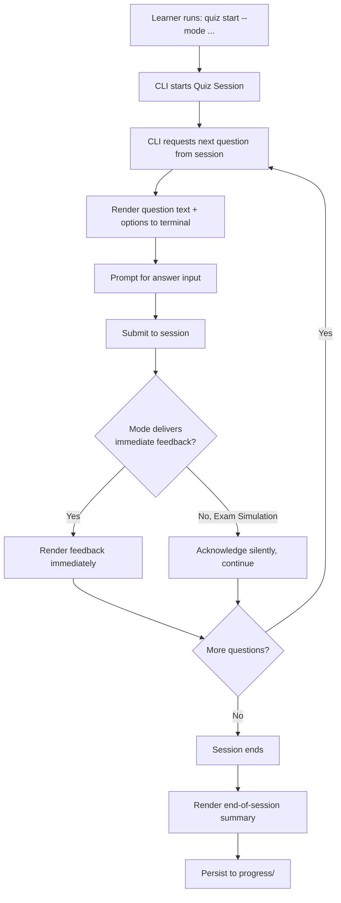

# Quiz Engine — CLI Design

## Purpose

Specifies the first realized interface (`roadmap.md`): a command-line study tool built as a thin client over the Quiz Session contract (`architecture.md`). This document describes command structure and interaction flow — not rendered screens, not implementation code.

## Why CLI First

Per `architecture.md`'s Python Package integration note, the CLI is expected to be a direct consumer of an importable engine library, with no network or browser dependency — the lowest-overhead way to validate that the Loader, Question Engine, Scoring, and Feedback stages actually work end-to-end before investing in a REST API or web application. This ordering is made explicit in `roadmap.md`.

## Command Structure (conceptual)

A single top-level command with subcommands, grouped by the concern each addresses. Exact naming (`study`, `cdmp`, etc.) is a build-time decision; the structure below specifies *behavior*, not a literal binary name.

| Command family | Example invocation shape | Behavior |
|---|---|---|
| Start a quiz | `<cli> quiz start --mode <mode> [--ka <KA>] [--difficulty <tier>] [--count <N>]` | Starts a new Quiz Session per `quiz_modes.md`; `--ka`/`--difficulty` apply only to the modes that use them (Knowledge Area Mode, Difficulty Mode) and are rejected with a clear error if passed to a mode that doesn't (e.g., `--ka` with `--mode exam` should be an error, not silently ignored, since Exam Simulation Mode's whole point is exam-weight sampling across all KAs) |
| Resume a quiz | `<cli> quiz resume` | Only meaningful for a session that was interrupted mid-way (relevant mainly for longer Exam Simulation sessions) — resumes from the Quiz Session's persisted in-progress state, not a new session |
| Answer during a session | Interactive prompt within the running session, not a separate subcommand | See Interaction Flow below |
| View progress | `<cli> progress show [--ka <KA>] [--since <date>]` | Renders `progress_integration.md`'s trend and weak-area data for the terminal — read-only, no session side effects |
| View readiness | `<cli> progress readiness` | Surfaces `scoring_engine.md`'s Readiness Indicator computed from recent sessions, with the partial-coverage caveat always shown alongside it, never omitted |
| Development mode flag | `<cli> quiz start --dev-unreviewed` | Explicit, loud opt-in to `data_loading.md`'s development mode — never a default, never a short/easy-to-typo flag, precisely because it serves unreviewed content |

## Interaction Flow



This is `architecture.md`'s sequence diagram, specialized for a terminal: "present question" becomes rendering text and a prompt; "submit answer" becomes reading stdin input; "deliver feedback" becomes printing the feedback payload before the next prompt.

## Illustrative Interaction (structure only — not literal question content)

The block below shows the *shape* of a terminal interaction, not real question content (`question_bank/authoring_guidelines.md`'s placeholder convention applies here too — nothing below is a real CDMP question).

```
$ <cli> quiz start --mode ka --ka GOV

Knowledge Area Mode — Data Governance (18 questions available)

Question 1 of 10 [Beginner]
[question stem placeholder]

  A) [option]
  B) [option]
  C) [option]
  D) [option]

Your answer: b

✓ Correct.
Explanation: [explanation placeholder]
Related concept: [DAMA] [concept name]
Related flashcards: [term]
Recommended revision: knowledge_base/data_governance.md, Section 3

Question 2 of 10 [Beginner]
...
```

## Answer Input Conventions

- **Single Answer / Scenario-Based (single-shape):** a single letter, case-insensitive.
- **Multiple Select / Scenario-Based (multi-shape):** a space- or comma-separated list of letters (e.g., `a c d`), evaluated per `answer_evaluation.md`'s all-or-nothing rule regardless of input order.
- **Invalid input** (a letter not among the presented options, or malformed multi-select input) is rejected with a re-prompt, never silently interpreted as an answer — the CLI must not guess.
- **No answer / skip:** the CLI should support an explicit skip that records the question as unattempted (distinct from incorrect) in the per-attempt record (`progress_integration.md`), since an unattempted question shouldn't count against a topic's miss rate the same way a genuinely wrong answer does.

## Session Timing (Exam Simulation Mode)

A visible, continuously updating countdown is expected for timed sessions (`quiz_modes.md`), rendered without interrupting the question-answer flow — an implementation concern (e.g., a separate display line vs. inline) deferred to build time, but the requirement that time remaining is always visible, not hidden until expiry, is a design requirement here.

## Output Formatting Principles

- Plain, readable terminal text by default — no assumption of a graphical terminal or specific emulator features.
- Correct/incorrect indicators (e.g., `✓`/`✗` in the illustrative example above) may use color where the terminal supports it, but must have a non-color fallback (the symbol itself), since not every terminal or piped-output context supports ANSI color.
- Long content (explanations, end-of-session summaries) should wrap to a reasonable terminal width rather than assuming an arbitrarily wide display.
- This is a *principle* list, not a UI spec — consistent with this document set's "no UI" constraint, actual formatting/rendering choices are implementation work.

## Session Persistence for Resume

A Quiz Session's in-progress state (questions served so far, answers given so far, remaining time for Exam Simulation Mode) must be persisted incrementally, not only at session end, so `quiz resume` can recover from an interruption (terminal closed, process killed) without losing progress. This persistence is separate from `progress_integration.md`'s completed-session records — it is transient, in-progress state, cleared once the session completes normally.

## Non-Goals of This Document

- No literal command-line flag syntax, argument parser library, or terminal rendering library is chosen.
- No packaging/distribution mechanism (how a learner installs the CLI) is specified — that belongs to `roadmap.md`'s Python Package phase.
