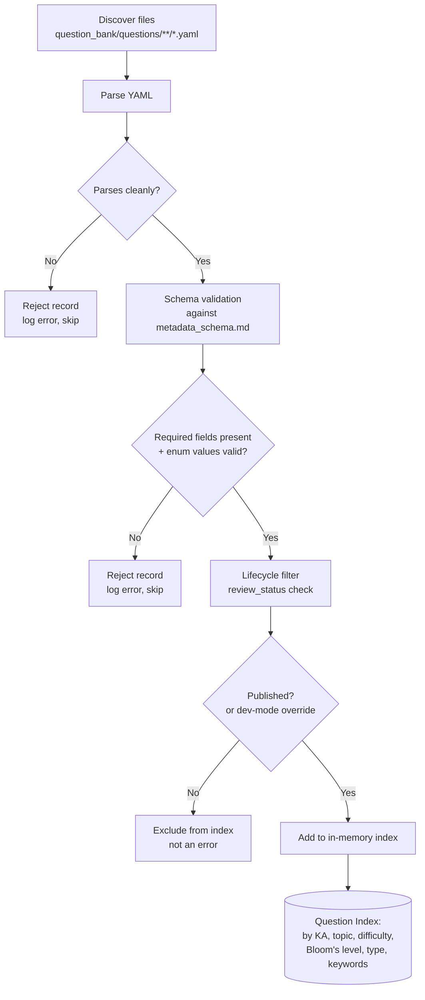

# Quiz Engine — Data Loading

## Purpose

Specifies the **Loader** stage (`architecture.md`): how the engine discovers, parses, validates, filters, and indexes question records from `question_bank/questions/**/*.yaml` so every later stage (Question Engine, Scoring, Feedback) can work against a trusted, structured, in-memory view rather than touching raw files.

## Loading Pipeline

A single malformed or invalid file **never halts the load** — it is skipped and logged, and loading continues. `question_quality_standards.md`'s and `metadata_schema.md`'s rules exist to prevent bad data from being *authored*; the Loader's job is to be defensive anyway, since it cannot assume every file it encounters was authored through the full pipeline (e.g., a future community contribution, per `question_bank/roadmap.md` Phase 5, arrives with no such guarantee yet).

## Step Detail

### 1. Discovery
Recursively enumerate `question_bank/questions/<KA_folder>/<ID>.yaml`, per the physical layout `question_bank/architecture.md` and `naming_conventions.md` define. The Loader does not assume a fixed list of Knowledge Area folders — it discovers whatever exists, so adding a 7th, 8th, ... Knowledge Area later (per `question_bank/roadmap.md` Phase 1's ongoing growth) requires no Loader change.

### 2. Parsing
Each file is parsed as a standalone YAML document into the field structure `metadata_schema.md` defines. A parse failure (malformed YAML) is a hard reject for that file only.

### 3. Schema Validation
Every required field from `metadata_schema.md`'s Field Reference table must be present, and every enum-constrained field (`difficulty`, `blooms_level`, `question_type`, `source_confidence`, `review_status`, `approval_status`) must hold one of its defined values. This is the same check `research/question_bank_phase1_validation.md` performed manually on the full 120-question set — the Loader performs it automatically, on every load, going forward. A record failing this check is rejected with a specific reason (which field, what was wrong), not a generic failure.

### 4. Lifecycle Filter — the Published/Draft Constraint

**This is the most consequential rule in this document.** Per `question_bank/question_lifecycle.md` and `architecture.md`'s "Question State Visibility by Consumer" table, only questions with `review_status: Published` are visible to any consuming system, including the Quiz Engine. The Loader enforces this by default.

**Current implication, stated plainly:** `research/question_bank_phase1_validation.md` confirms all 120 Phase 1 questions currently carry `review_status: "Draft"`. Under strict default behavior, **the Loader would index zero questions today.** This is not a Loader defect — it is the correct, honest consequence of a governance rule this project already adopted (`question_bank/review_process.md`'s Gate 1/2/3 pipeline has not yet run on any Phase 1 question). The engine must not quietly work around this by treating Draft as Published; that would silently defeat the review gates the Question Bank system exists to enforce.

**Two supported loading modes, to make this workable during development without weakening the rule:**

| Mode | Behavior | When used |
|---|---|---|
| **Strict mode (default)** | Only `review_status: "Published"` records are indexed. | Any real study session, once questions exist at that state. This must remain the default in every interface (`cli_design.md` et al.) without an explicit override. |
| **Development mode** | Indexes `Draft` (and any other non-Retired state) records, with every question and every session output visibly tagged (e.g., a `[DEV/UNREVIEWED CONTENT]` marker) so it can never be mistaken for validated study material. | Only for testing the engine's own mechanics (does selection/scoring/feedback work correctly) before Phase 1 content has cleared review. Never the default; must be explicitly requested. |

This distinction should be a first-class, loud setting in every future interface — not a hidden flag — because serving unreviewed content as if it were validated study material would be a governance failure, not just a technical inconvenience.

### 5. Indexing
Validated (and lifecycle-eligible) records are organized into an in-memory index supporting fast lookup by every dimension `question_selection.md`'s modes need: Knowledge Area, topic/subtopic, difficulty, Bloom's level, question type, and keyword. This mirrors the Access Layer query capability `question_bank/architecture.md` already specifies conceptually ("query by combinations of Knowledge Area, topic, difficulty, question type, and Bloom's level") — the Loader's index is the Quiz Engine's local implementation of that same capability, not a competing design.

## Load Timing and Refresh

- **Load-once-per-process** is the default assumption: the index is built at startup (CLI invocation, API process boot) and held for the process's lifetime.
- **Hot-reload** (re-scanning `question_bank/questions/` without restarting) is a reasonable future capability for a long-running API/web process, but is explicitly deferred — not required for the CLI, where a fresh process per invocation makes it moot.
- The Loader never writes back to `question_bank/questions/` under any circumstance, in either mode — this is absolute, not configurable, consistent with `question_bank/architecture.md`'s read-only consumer principle.

## Error Reporting

Every rejected file (parse failure, schema violation) should be reported with: the file path, the specific reason, and — for schema violations — the specific field and expected vs. actual value. This mirrors the specificity standard `question_bank/review_process.md`'s gate checklists already use for human reviewers; the Loader's error output is the automated equivalent.

## Implementation Note (not a design decision, flagged for later)

`research/question_bank_phase1_validation.md` noted no YAML parsing library was available in the environment used for manual validation. A real implementation will need to select one (e.g., a standard YAML library for whatever language the engine is built in) — this is an implementation dependency to resolve when `roadmap.md`'s build phase begins, not a decision this design document makes.
