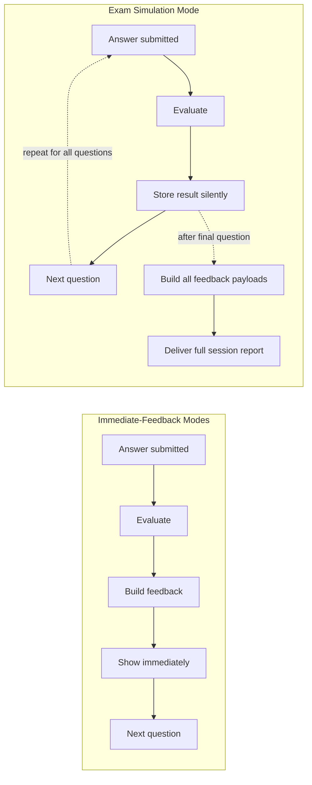

# Quiz Engine — Feedback System

## Purpose

Specifies the **Feedback** stage (`architecture.md`): what a learner sees after answering a question (or, in Exam Simulation Mode, after the session ends), built from the Scoring stage's result plus the question record's own metadata. Feedback is a read-only presentation payload — it never mutates the question, the score, or progress data; it only assembles what those upstream stages already produced into something a learner can act on.

## The Five Required Elements

Every feedback payload contains, at minimum:

| Element | Source | Notes |
|---|---|---|
| 1. Correct/Incorrect | `answer_evaluation.md`'s grading result | Always shown first — the learner's immediate question |
| 2. Explanation | The question's `explanation` field | Full reasoning for the correct answer, per `question_bank/authoring_guidelines.md`'s explanation standard — never truncated or paraphrased by the engine |
| 3. Related concept | The question's `dama_concept` / `industry_practice_concept` fields | Shown with its tag intact (`[DAMA]` or `[Industry Practice]`) — the engine must preserve this distinction, never collapse it into an untagged "concept" label |
| 4. Related flashcards | The question's `related_flashcards` field | Points back to the term/definition entries in the source `knowledge_base/*.md` module's Flashcards section (Section 12) |
| 5. Recommended revision | The question's `references` field | Points to the specific `knowledge_base/*.md` file and section to re-read — the same citation used for DAMA Review (`question_bank/review_process.md`), repurposed here for learner remediation |

## Additional, Targeted Detail (beyond the five required elements)

- **Why-incorrect targeting** (`answer_evaluation.md`): for a wrong Single-Answer response, only the `why_incorrect` entry for the option the learner actually picked is shown. For a wrong Multiple-Select response, every incorrectly-included option's entry is shown, plus which correct options were missed — assembled from the fine-grained detail `answer_evaluation.md`'s Multiple-Select evaluation already captures.
- **Related exercises**: if the question's `related_exercises` field is populated, surfaced as an optional "go deeper" pointer alongside recommended revision — lower priority than the required five, shown when available.
- **Timing note**: if the learner's time taken significantly exceeded the question's `estimated_solving_time` (`answer_evaluation.md`), a soft, non-judgmental note may be included (e.g., "this one took longer than typical — worth reviewing if the concept felt unfamiliar rather than just the reading").

## Feedback Timing Per Mode

Per `quiz_modes.md`'s mode table: Practice, Knowledge Area, Difficulty, and Weakness modes deliver the full feedback payload **immediately** after each answer, before the next question is presented. Exam Simulation Mode **defers every element** until the session ends, then delivers the full payload for every question at once in the end-of-session report — matching the real exam's closed-book, no-mid-exam-feedback format (`quiz_modes.md`, Exam Simulation Mode).

## End-of-Session Summary

Every mode, not only Exam Simulation, produces an end-of-session summary once the session ends — this is distinct from per-question feedback and aggregates across the whole session:

- All five score types from `scoring_engine.md` (Raw Score, Percentage, Knowledge Area Score(s), Difficulty Adjustment, Readiness Indicator where applicable).
- A list of topics/Knowledge Areas where performance was weakest this session — the same signal `progress_integration.md` persists for future Weakness Mode selection, shown here in-session so the learner doesn't have to wait for a separate progress report to see it.
- For Exam Simulation Mode specifically, the honest coverage disclosure `quiz_modes.md` requires (partial-KA-coverage caveat) is part of this summary, not a separate screen the learner might miss.

## Handoff Point: AI Tutor Integration

Per `architecture.md`'s Future Integration section, the AI Tutor plugs in here, at the Feedback stage, specifically to **expand on** an explanation the learner wants more depth on — not to replace it. The handoff contract:

1. The Feedback payload (as specified above, including the `[DAMA]`/`[Industry Practice]`-tagged related concept and the `references` citation) is passed to the AI Tutor as grounding context.
2. The AI Tutor's expanded response must be traceable back to that grounding context — it may elaborate, give an additional example, or connect to a related Knowledge Area, but it must not introduce a new DAMA claim unsupported by the question's own metadata or the cited `knowledge_base/` section, per `question_bank/architecture.md`'s AI Tutor consumer definition (inherited here, not re-decided).
3. If a learner's follow-up question genuinely requires content outside the cited section, the AI Tutor should say so and point toward where that content would need to be authored (a `knowledge_base/` gap) rather than fabricate an answer to fill it.

## Development-Mode Content Warning

Per `data_loading.md`, if the active session drew from unreviewed (`Draft`) content because the Loader was run in development mode, **every** feedback payload in that session — per-question and end-of-session summary alike — must visibly carry that warning. Feedback is exactly the layer where a learner could otherwise mistake unreviewed content for validated study material; this design does not allow that warning to be dropped silently at this stage even if it was set correctly upstream.

## Non-Goals of This Document

- No rendering/formatting is specified — how feedback looks in a terminal (`cli_design.md`), an API response, or a web page is an interface-layer concern, not this document's.
- No AI Tutor prompt design or model selection is specified — only the handoff contract's content boundaries.
