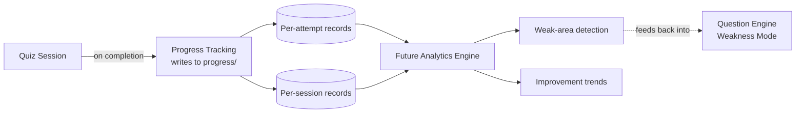

# Quiz Engine — Progress Integration

## Purpose

Specifies the **Progress Tracking** stage (`architecture.md`): how a completed Quiz Session's results are persisted to `progress/`, how that data supports a future Analytics layer, how "weak areas" are defined and detected, and how improvement trends are computed over time.

## Relationship to `progress/` and a Future Analytics Layer

`progress/` already exists in the project structure (`CLAUDE.md`, "Project Structure": *"Tracking of study progress, scores, and milestones over time"*) but is currently empty — no record shape has been defined for it until now. This document proposes that shape.

Consistent with `question_bank/architecture.md`'s content/delivery separation principle, this design draws a second, parallel separation: the **Quiz Engine produces progress data**; a **future Analytics Engine consumes and aggregates it**. The Quiz Engine's Progress Tracking stage is a data *producer* — it writes clean, structured, per-attempt and per-session records. It does not itself build dashboards, trend charts, or cross-session statistical analysis; that is `question_bank/architecture.md`'s already-named "Analytics Engine" consumer, a distinct future system this document does not redesign. This keeps the Quiz Engine's own scope bounded — it emits event data, it doesn't become an analytics platform.

## Proposed Record Shapes (conceptual — no file format chosen)

### Per-Attempt Record
One record per answered question, the finest-grained unit of history:

| Field | Purpose |
|---|---|
| `question_id` + `version` | Identifies exactly which question record was answered — both fields, never `question_id` alone, per `question_bank/versioning.md`'s principle that a response stays valid even after the question is later revised |
| `session_id` | Links back to the session this attempt belongs to |
| `knowledge_area`, `topic`, `subtopic`, `difficulty`, `blooms_level` | Copied from the question at answer time (not re-derived later) so historical analysis remains accurate even if the question's classification changes in a future version |
| `question_type` | For type-specific trend analysis later (e.g., "does this learner do worse on Multiple Select specifically") |
| `learner_answer` | What was actually submitted (single letter or set) |
| `correct` | Boolean grading result from `answer_evaluation.md` |
| `time_taken` | Seconds, from `answer_evaluation.md`'s timing capture |
| `mode` | Which of the five quiz modes this attempt occurred under |
| `timestamp` | When the attempt occurred |

### Per-Session Record
One record per completed session, summarizing the attempts within it:

| Field | Purpose |
|---|---|
| `session_id` | Primary key linking to its per-attempt records |
| `mode`, `filters` | What kind of session this was (e.g., Knowledge Area Mode, filtered to GOV) |
| All five score types (`scoring_engine.md`) | Raw Score, Percentage, Knowledge Area Score(s), Difficulty Adjustment, Readiness Indicator |
| `coverage_caveat` | Whether partial-Knowledge-Area-coverage applied (relevant for Exam Simulation sessions especially) |
| `development_mode_flag` | Whether this session drew from unreviewed content (`data_loading.md`) — historical records must preserve this so past sessions aren't later mistaken for validated-content performance |
| `started_at`, `completed_at` | Session timing |

**Why two record levels, not one:** per-attempt records are what weak-area detection needs (topic-level granularity); per-session records are what trend tracking and quick-glance progress review need (session-level summaries). Deriving session summaries from attempt records on every read would work but is wasteful; storing both, with the session record as a materialized rollup, is the simpler design at this project's scale.

## Weak-Area Detection

**Definition of "weak":** a topic (or, if attempt volume is too low for topic-level granularity, a Knowledge Area) where the learner's miss rate over their most recent N attempts on that topic exceeds a threshold — proposed default: miss rate > 40% over at least 4 attempts. Both numbers (threshold, minimum sample) are engine configuration, not DAMA or exam-official figures, and should be revisited once real usage data exists.

**Why a minimum sample size matters:** a single wrong answer on a topic attempted once is noise, not a demonstrated weakness (already flagged in `question_selection.md`'s Weakness Mode algorithm — this document is where that rule is actually defined, and `question_selection.md` correctly defers to it). Flagging a topic "weak" off one data point would make Weakness Mode unreliable and erode trust in the signal.

**Recency weighting:** consistent with `scoring_engine.md` §5's Readiness Indicator, weak-area detection should weight recent attempts more heavily than old ones — a topic the learner struggled with two months ago but has since correctly answered several times in a row should stop being flagged, even if the lifetime miss rate on that topic is still technically above threshold.

**Output:** a ranked list of weak topics (highest miss rate first, subject to the minimum-sample and recency rules above) — this is exactly the input `question_selection.md`'s Weakness Mode algorithm consumes (dotted feedback line in `architecture.md`'s End-to-End Flow diagram).

## Improvement Trends

**Definition:** for a given Knowledge Area or topic, the sequence of that area's Knowledge Area Score (`scoring_engine.md` §3) across sessions over time, showing whether performance is improving, flat, or declining.

**Direct tie to the existing study plan:** `roadmap/four_month_plan.md` already anticipates this — Weeks 13–16 explicitly compare practice-exam scores "against Week 13's results" and track "a clear before/after comparison" in `progress/`. This document's trend design exists specifically to make that already-planned comparison possible; it is not a speculative feature, it is filling in a gap the roadmap already assumed would be there.

**Minimum viable trend output:** for each Knowledge Area with sufficient history, a simple time-ordered list of (date, score) pairs is sufficient for this phase — charting/visualization is a presentation-layer concern (`cli_design.md` or a future web app), not something Progress Tracking itself needs to render.

## What This Document Does Not Persist

- **No raw question content** is duplicated into `progress/` — per-attempt records reference `question_id` + `version`; the question's own content stays solely in `question_bank/`, consistent with the content/delivery separation principle. A future report renderer joins attempt records back to `question_bank/` (via the Loader) to show full context, rather than progress records carrying their own copy that could drift out of sync.
- **No cross-learner data** — this project is single-learner (`architecture.md`'s Non-Goals already establishes this); no multi-user schema is designed.

## Non-Goals of This Document

- No file format (JSON, CSV, SQLite, etc.) is chosen for `progress/` — that's an implementation decision for `roadmap.md`'s build phase.
- No dashboard, chart, or report rendering is designed — that belongs to a future Analytics Engine or a presentation-layer interface, not this stage.
- No statistical trend-detection algorithm (regression, moving average, etc.) beyond "weight recent more than old" is specified — deferred to implementation.
