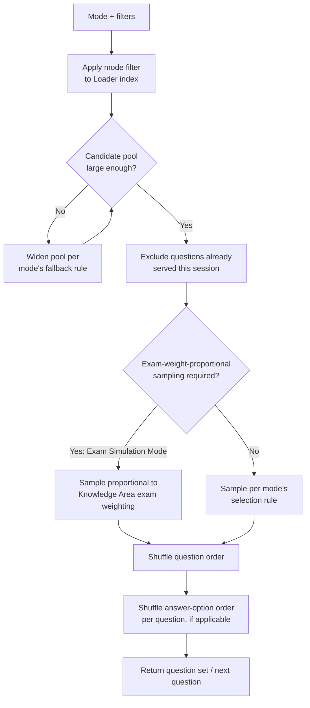

# Quiz Engine — Question Selection

## Purpose

Specifies the **Question Engine** stage (`architecture.md`): given a quiz mode, its filters, and the active Quiz Session's history, how the next question (or the full question set, for modes that assemble up front) is chosen from the Loader's index.

## Selection Inputs

Every selection decision draws on up to four inputs:

1. **The Loader's index** (`data_loading.md`) — the full set of currently eligible (Published) questions.
2. **Mode configuration** — the filters a specific mode applies (Knowledge Area, difficulty, timing profile) per `quiz_modes.md`.
3. **Session history** — which questions have already been served *this session*, to avoid immediate repeats.
4. **Progress history** (Weakness Mode only) — prior sessions' results, read from `progress_integration.md`'s persisted records, to identify topics/questions worth re-serving.

## Core Selection Algorithm (shared shape across modes)

Every mode in `quiz_modes.md` is a configuration of this same algorithm — a different filter (step B), a different fallback rule (step D), and a different sampling rule (step F/G/H) — not five independently implemented selection engines. This is deliberate: it keeps the five modes consistent in behavior (anti-repetition, shuffling) and cheap to extend later (`roadmap.md`'s Adaptive Questions phase, per `question_bank/roadmap.md` Phase 3, is designed to slot into step H as a new sampling rule, not a new pipeline).

## Filter Definitions Per Mode

| Mode | Primary filter (step B) | Fallback if pool too small (step D) |
|---|---|---|
| Practice Mode | None (entire eligible index) | N/A — pool is the whole bank |
| Knowledge Area Mode | `knowledge_area == <selected KA>` | None — if a KA has too few questions, say so explicitly rather than silently pulling from other KAs, since that would violate the mode's own purpose |
| Difficulty Mode | `difficulty == <selected tier>` | None — same reasoning as above |
| Exam Simulation Mode | All KAs, sampled by exam weight (see below) | If a required KA has zero eligible questions (true today for 8 of 14 KAs per `research/question_bank_audit.md` §10), the simulation must clearly disclose the gap in its summary rather than silently under-filling — see `quiz_modes.md` |
| Weakness Mode | Questions/topics flagged weak by `progress_integration.md` | Falls back to Difficulty Mode-style broadening (serve more from the same weak Knowledge Area at a lower difficulty) if the flagged pool is too small for a full session; see below |

## Exam-Weight-Proportional Sampling (Exam Simulation Mode)

Per `question_bank/architecture.md`'s own Mock Exam Engine definition and `research/cdmp_exam_overview.md`'s documented Knowledge Area weighting (~11% each for Governance/Modeling/Quality/Metadata, ~10% each for Reference & Master Data/DW&BI, remaining weight spread across the other eight), a faithful exam simulation must draw questions from each Knowledge Area in proportion to its real exam weight — **not** evenly across whatever Knowledge Areas happen to have content. Concretely: a 100-question simulation should draw roughly 11 questions from Governance, 11 from Modeling, and so on, not 100/6 ≈ 17 evenly split across only the 6 currently-populated Knowledge Areas.

This means, honestly, that **no current simulation can be exam-weight-faithful** while 8 of 14 Knowledge Areas have zero content — a shorter, clearly-labeled "Partial Mock Exam (6 of 14 Knowledge Areas)" is the correct behavior today, not a full-length simulation that quietly misrepresents its own coverage. See `quiz_modes.md`, Exam Simulation Mode, for how this is disclosed to the learner.

## Anti-Repetition Logic

Within a single session, a question already served is never served again — enforced by excluding `question_id` values already present in session history (step E). Across sessions, the engine should — once `progress_integration.md`'s history is available — favor under-served questions over recently-served ones when the candidate pool is large enough to make that meaningful, so a learner doing many Practice Mode sessions over weeks doesn't repeatedly see the same small subset. This is a soft preference, not a hard exclusion (unlike within-session repetition), since a small candidate pool must still be usable.

## Weakness Mode Selection — the Feedback Loop in Detail

Weakness Mode is the one mode that cannot function without `progress_integration.md`'s output, so its algorithm is specified in full:

1. Read the learner's per-topic/per-Knowledge-Area miss-rate from Progress Tracking (definition of "weak" lives in `progress_integration.md`).
2. Rank topics by miss rate (highest first), excluding topics with too few historical attempts to be statistically meaningful (a single wrong answer on a topic attempted once is noise, not a demonstrated weakness — `progress_integration.md` defines the minimum attempt threshold).
3. Build the candidate pool from questions in the ranked weak topics, preferring ones the learner has answered incorrectly before *and* has not seen recently (combining the weak-topic signal with the anti-repetition preference above).
4. If the resulting pool is smaller than the requested session length, broaden by including more questions from the same weak Knowledge Area at adjacent difficulty tiers, before falling back to the topic ranking's next tier down. Never silently pad with unrelated, non-weak content — if the pool still can't be filled, the session should be shorter and say so, not misrepresent itself as a full Weakness session.
5. **Cold start:** a learner with no prior session history has no weak-area signal at all. Weakness Mode should detect this explicitly and either decline to start with a clear explanation, or offer to run a short diagnostic Practice/Difficulty session first specifically to generate the signal it needs — not silently fall back to a random selection that looks like Weakness Mode but isn't.

## Shuffling

- **Question order** is shuffled per session (step I) so repeated sessions with an overlapping pool don't present questions in the same sequence.
- **Answer-option order** is shuffled per question presentation (step J) where the question type supports it (Multiple Choice, Multiple Select, and MC/MS-shaped Scenario-Based questions per `answer_evaluation.md`) — this requires the engine to track the shuffled-to-original letter mapping internally so `correct_answer` evaluation still works against the question's original lettering; the *learner* never sees the original letters if they were reshuffled. This detail belongs to Scoring/Evaluation, not Selection, but is noted here since it's a direct consequence of this stage's output ordering.

## Non-Goals of This Document

- No concrete sampling algorithm (e.g., specific random-number-generation approach) is specified — implementation detail.
- No adaptive/ML-based selection is designed here — that is `question_bank/roadmap.md` Phase 3 (Adaptive Questions), explicitly out of scope until the static selection rules above are built and proven.
