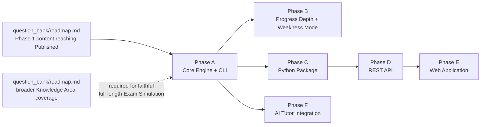

# Quiz Engine — Roadmap

## Scope Note

This roadmap sequences *implementation* work. Per this design phase's explicit rules, no implementation begins as a result of publishing this document — these ten `quiz_engine/` documents are the specification that future implementation work will be built against, not a build log. It is also distinct from `question_bank/roadmap.md`'s Phase 1–5 content-maturity phases; the two roadmaps intersect (Phase A below depends on Question Bank content reaching `Published`), but they are not the same numbering scheme.

## Phase A — Core Engine + CLI

**Goal:** Implement the Loader, Question Engine, Scoring, Feedback, and a minimal Progress Tracking write path (`architecture.md`), exposed only through the CLI (`cli_design.md`).

**Entry criteria:**
- This design (all 11 `quiz_engine/` documents) is stable.
- At least some `question_bank/questions/` records have advanced from `Draft` to `Published` via `question_bank/review_process.md`'s Gate 1/2/3 pipeline — per `data_loading.md`, strict-mode loading depends on this, and the correct fix is running Phase 1 content through review, not weakening the Loader's default behavior.

**Deliverable:** A working CLI supporting all five quiz modes against whatever Published content exists at the time, with progress persisted in whatever minimal form `progress_integration.md`'s record shapes take.

**Explicit non-goal for this phase:** exam-weight-faithful full-length Exam Simulation — per `quiz_modes.md`, this remains a "Partial Mock Exam" until Knowledge Area breadth grows, regardless of how complete the engine code itself is.

## Phase B — Progress Depth + Weakness Mode

**Goal:** Build out `progress_integration.md`'s weak-area detection and trend tracking fully enough for Weakness Mode (`quiz_modes.md`) to function as designed, not just in cold-start fallback.

**Entry criteria:** Phase A has been in real use long enough to accumulate genuine session history — Weakness Mode's minimum-sample-size rule (`progress_integration.md`) means this phase can't be meaningfully tested on day one of Phase A.

**Deliverable:** Weakness Mode moves from "always cold-start fallback" to actually selecting from real weak-topic history; a `progress show` / `progress readiness` reporting view (`cli_design.md`) mature enough to be genuinely useful for weekly self-review, directly serving `roadmap/four_month_plan.md`'s Weeks 13–16 before/after comparison needs.

## Phase C — Python Package Formalization

**Goal:** Formalize the engine core (already built as an importable library per `architecture.md`'s Python Package integration note in Phase A, in practice) into a properly packaged, documented, independently versioned distribution.

**Entry criteria:** Phase A/B's core logic is stable enough that packaging it makes sense — packaging churn-prone code wastes the effort.

**Deliverable:** An installable package with a stable public API (the Quiz Session contract from `architecture.md`), enabling Phase D and Phase E to build against it without depending on CLI internals.

## Phase D — REST API

**Goal:** A thin HTTP wrapper exposing the same Quiz Session contract the CLI already uses internally (`architecture.md`'s Future Integration section).

**Entry criteria:** Phase C's package API is stable — the REST API should be a thin translation layer, not a second implementation of session/scoring/feedback logic.

**Deliverable:** HTTP endpoints for start/next-question/submit-answer/end-session/progress-query, with authentication/multi-user concerns still explicitly out of scope (`architecture.md`'s Non-Goals) unless the project's single-learner premise changes by the time this phase is reached.

## Phase E — Web Application

**Goal:** A presentation layer over the REST API (`architecture.md`) — no new session, scoring, or selection logic.

**Entry criteria:** Phase D's API is stable and has been exercised by at least the CLI (migrated to call the API instead of the package directly, or run alongside it) to validate the API contract is actually sufficient before a second client depends on it.

**Deliverable:** A web UI for the same five quiz modes, subject to this design's "no UI" constraint not applying anymore once this phase is actually reached (that constraint governs this specification phase, not eventual implementation).

## Phase F — AI Tutor Integration

**Goal:** Implement the Feedback-stage handoff contract `feedback_system.md` already specifies — grounded explanation expansion, not new DAMA claim generation.

**Entry criteria:** Feedback payloads (Phase A onward) are stable and complete enough to serve as reliable grounding context; explicitly does not require Phases C–E to be complete, since the AI Tutor handoff point is the Feedback stage in the engine core, not the web application.

**Deliverable:** An AI Tutor integration point usable from any interface that reaches the Feedback stage — CLI, API, or web — following the grounding-and-boundary rules `feedback_system.md` already defined, not redesigned at this phase.

## Phase Dependency Summary

## Explicit Non-Goals of This Roadmap

- No timeline or effort estimate is attached to any phase, consistent with this project's self-paced, sustainable study approach (`CLAUDE.md`).
- No phase begins as a result of publishing this roadmap.
- No technology stack, hosting, or deployment decision is made here — every phase's "Deliverable" describes behavior, not implementation.
